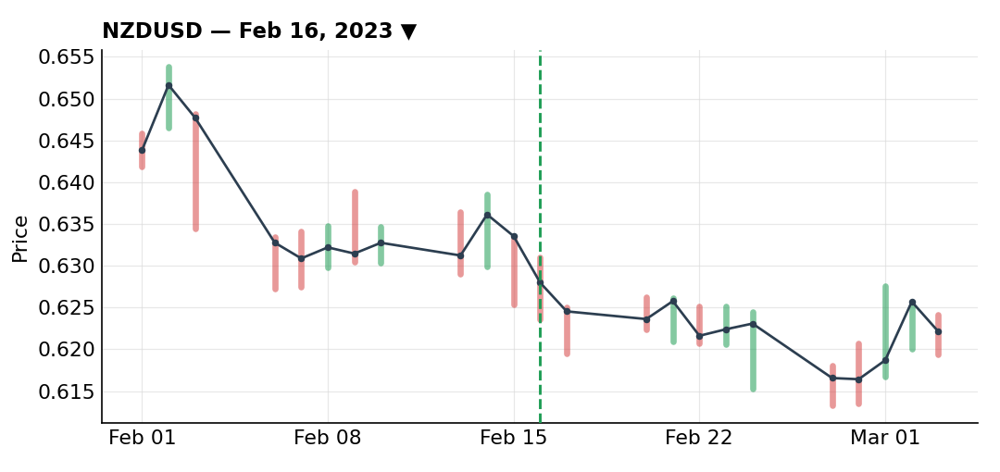
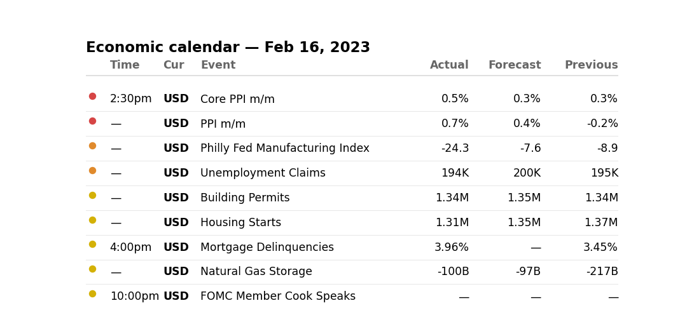
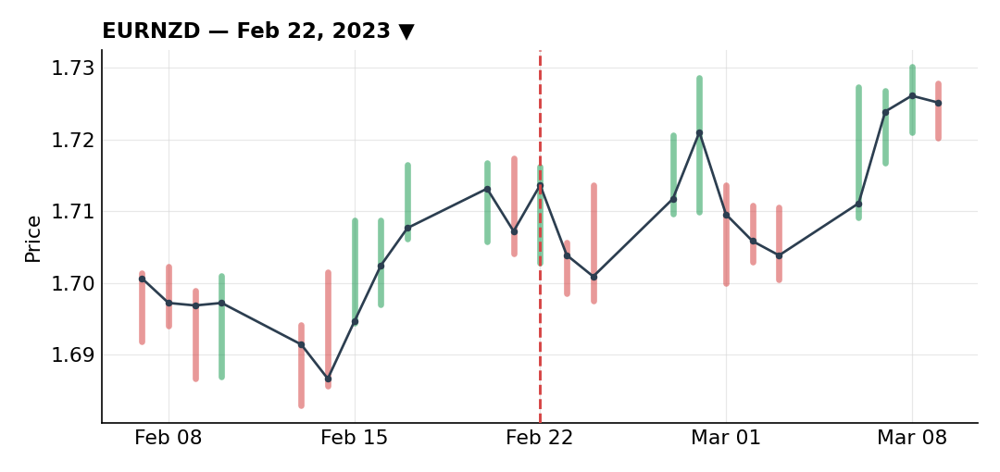
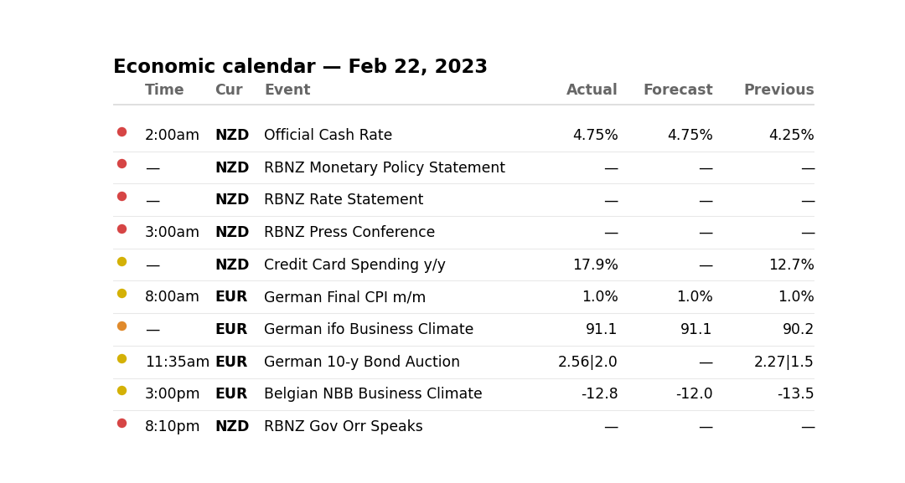
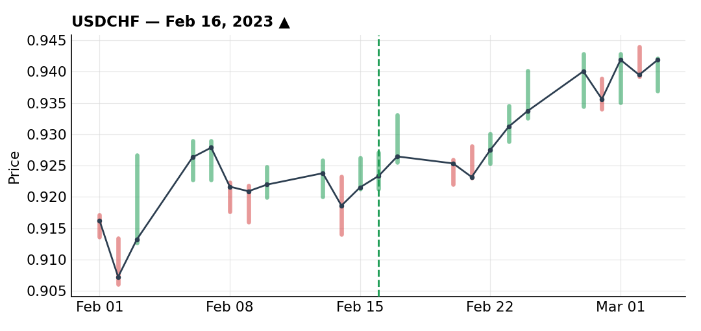

# February 2023

### Short NZD/USD — risk-off pressure on the kiwi

***NZDUSD** · short · closed · +5.65R · Feb 16, 2023*

NZD was under pressure from broad risk-off sentiment, and on the other side of the pair the dollar had support from strong inflation data and an economy that looked like it was running hot enough to keep the Fed in play. With both the fundamental and technical picture pointing the same way, I ran this one at full risk.

The add-in was well placed and the trade worked nicely in my favor. I ended up closing early on the first signs of a potential reversal — and, looking back, my trailing stop management on this one wasn't great; I trailed it in a way that cost me some of the move. Still closed out for +5.65R, my best result of the month, but a good reminder to tighten up how I trail winners once a trade is clearly working.

**Economic calendar that day:**

### Short EUR/NZD wicked out — a repeat management mistake

***EURNZD** · short · closed · -1.00R · Feb 22, 2023*

This one was set up partly as a hedge against my NZD/USD short, and it carried positive swap, so the carry cost of holding wasn't a concern. The technical case was there too.

It got wicked out — stopped on a spike rather than a sustained move against me — for -1R. What bothers me more than the loss itself is that this was the second time this kind of trade-management mistake showed up. Worth flagging clearly for myself: I need to look at how I'm placing stops relative to likely wick ranges, especially on hedge-style positions like this one, since I've now made the same error more than once.

**Economic calendar that day:**

### Long USD/CHF off a tight breakout, sized down for correlation

***USDCHF** · long · closed · +1.93R · Feb 16, 2023*

Retail was heavily long this pair — around 77% — which on its own would push me toward fading it, but I already had dollar-long exposure on through the NZD/USD short, so I cut my size on this one to 60% of normal risk to manage the correlation between the two positions.

I took the entry right at the breakout because it offered a genuinely tight stop — exactly the kind of opportunity I want to take even against the crowded positioning, since the risk was well defined. I built the full position in two 30% tranches, which let me get to roughly a 3R risk-to-reward setup without ever touching either my stop or my take-profit level along the way. Given the move was largely fundamentally driven, I gave it wide management rather than trying to micromanage the exit, and it closed out for +1.93R.

**Economic calendar that day:**

---

*+6.58R logged · 2W/1L*