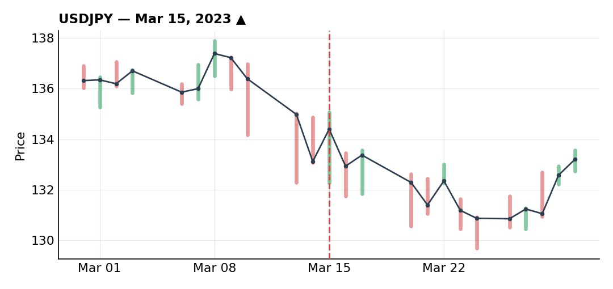
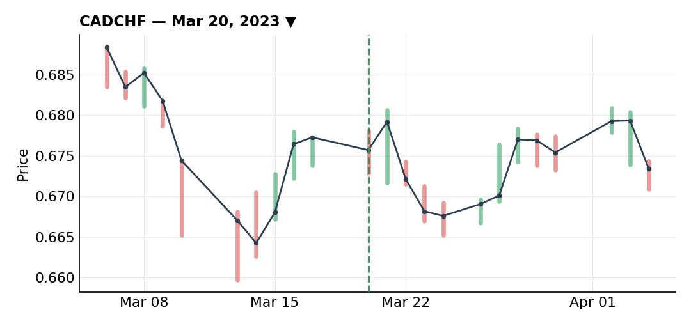
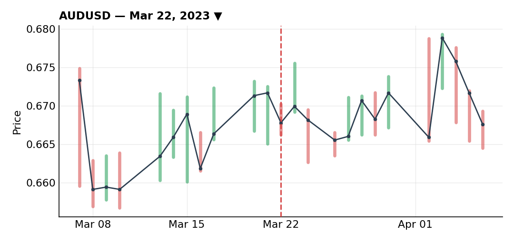

# March 2023

### Cut USD/JPY long early once the setup stopped making sense

***USDJPY** · long · closed · -0.21R · Mar 15, 2023*

The higher timeframe downtrend had just broken to the upside, and price pulled back into the 50% retracement, which lined up with an old resistance level that had flipped into support. I got a bullish rejection on the 15-minute chart after it broke a small downtrend structure, which gave me a good risk/reward entry, so I put in a buy limit.

I sized this down to 35% of my normal risk going in — US CPI was coming up and the Fed was in a genuinely uncertain spot because of the banking crisis, and I was already carrying dollar exposure through an AUD/USD short. The fill itself wasn't clean either: my buy limit executed but not really on a proper correction, so I was already looking for an early way out almost as soon as I was in.

The scenario I wanted — a gradual pullback before an impulse higher — never showed up. Price reversed hard and ran straight through my limit orders into a loss. As soon as it was clear the thesis was invalid I started closing: half the position out for a small loss, the rest on the stop (already reduced to that 35% sizing), for a net -0.21R.

The lesson I keep coming back to from this one: never hold a position just because it was valid when you opened it. If the scenario breaks, get out — a small, managed loss beats hanging onto a thesis that's already dead.

### CAD/CHF short scaled out perfectly through the Credit Suisse panic

***CADCHF** · short · closed · +1.77R · Mar 20, 2023*

Oil was falling hard that week, which drags CAD down given how tightly correlated the two are. At the same time the SNB was intervening in the open market buying CHF, and more importantly CHF itself looked undervalued because of the panic around Credit Suisse — March 2023 was the month of the banking crisis (SVB, First Republic, and then Credit Suisse), and that panic had knocked CHF and EUR down in a move I thought was overdone and ripe for a correction. Retail was 90% long the pair, which is exactly the kind of contrarian signal I want to fade.

On the 4H there was a well-defined support/resistance level, a violent spike higher on the CHF panic, and then a pullback back into that resistance area — which also lined up with Fibonacci levels and the 50 SMA. I put my stop just behind a small swing, tucked behind the 61.8% retracement. Price moved against me a bit first before turning down — no room to add, since the pullback never got deep enough to reach the 50% fib.

The real strength of this trade was the management. I scaled out in pieces on every sign of a bullish reversal on the lower timeframes — 40% off at the 78.6% fib on the first signs of strength, moved my stop up behind the new high, then another 40% off after a bullish divergence formed (what looked like a possible inverse head-and-shoulders), and moved the stop again. Price ended up running further than I expected, which validated the cautious, staggered exit in hindsight.

Not a huge R number in the end, but this is the kind of trade I want to point to when I think about what good management looks like.

### Widened my stop into FOMC and paid for it on AUD/USD

***AUDUSD** · short · closed · -1.30R · Mar 22, 2023*

I opened this ahead of the March FOMC decision, in the middle of the banking crisis, when the market was pricing a dovish Fed after weeks of hawkish rhetoric. My reasoning: if everyone's positioned for dovish and the Fed instead comes out relatively hawkish, the move is going to be much more violent than if it just confirms what's already priced in — that asymmetry made a AUD/USD short look like an attractive risk/reward.

At the statement, price spiked fast toward my stop as the market read the release as dovish. Instead of letting the stop do its job, I widened it by about 30% — pushing my risk from -1R to -1.3R — to give the trade room into Powell's press conference, hoping for a more hawkish tone that would bring price back down. The press conference ended up being neither clearly hawkish nor dovish, but the market read it dovish again anyway; AUD/USD kept climbing and took me out on the widened stop for -1.3R.

In hindsight this was an emotional decision, one of the very few times I've done something like it. A cleaner way to handle it would have been to leave the original stop alone and open a same-size long as a synthetic hedge instead — that would have given the trade room without actually increasing my net risk.

### Back into USD/JPY long after the early stop-out

***USDJPY** · long · still open · +1.05R floating · 2023-03*

After closing the first USD/JPY long early for a small loss, I got back into a long on the same pair — the setup still looked valid to me even though the first attempt hadn't worked out. Price kept climbing after I re-entered, which dragged my Fibonacci reference levels up with it as the move extended.

This is the position still open as the month closes out, sitting on a floating profit of roughly +1.05R, carrying over into April.

---

*+0.26R logged · 1W/2L*