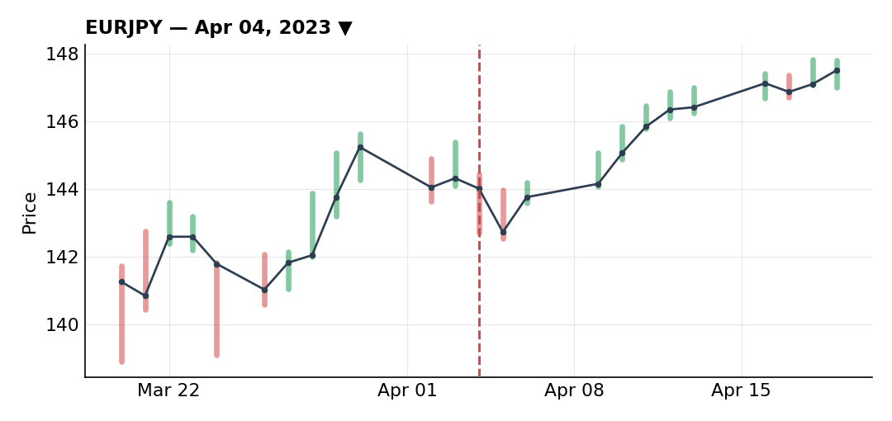
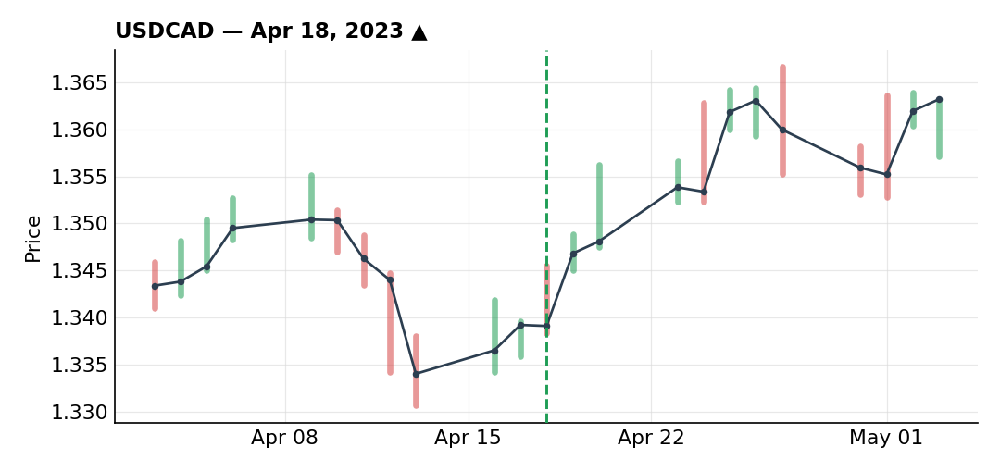
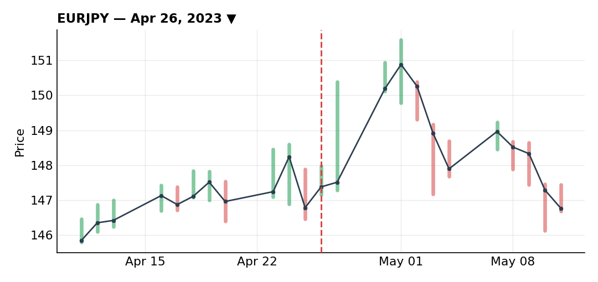

# April 2023

### Clean technical EUR/JPY short, managed down to a scratch loss

***EURJPY** · short · closed · -0.25R · Apr 04, 2023*

This one was 100% technical, zero fundamental backing — early in the month, with nothing catalyst-worthy on the calendar. Resistance had been rejected and price was pulling back into it. I actually missed the first chance to get filled on that pullback, but eventually got in on a return to the 50% Fibonacci, with a nice trendline sitting in confluence.

I cut size to 50% given the lack of any fundamental case and because more than 80% of retail was also short the pair — when everyone's leaning the same way I want to be, with nothing else backing it up, I don't want to send real size.

The trade worked at first — a clean initial impulse down, an obvious pullback I'd anticipated from the price action, a slight slowdown, then a break higher back toward the fib levels, exactly the pattern I like trading. I could have taken partials right there and didn't. A further pullback still looked like it favored more downside, but price kept climbing instead, giving back the open profit. Stepping back and reading the structure as a whole — impulse, correction, recovery with real strength behind it — I judged the odds now favored more upside than a resumption lower. Rather than fully exit a trade I still thought was valid at the outset, I cut it in half at my entry price, leaving just 25% of the original risk on.

Price kept climbing and eventually took out the remaining 25%, for a final loss of just -0.25R instead of the -0.5R a full-size hold would have cost — or -1R if I'd been at full risk from the start. That kind of progressive de-risking is something I should apply more often, even though I could have executed even this one a bit better.

### USD/CAD long on the oil-driven CAD selloff — undersized and I know it

***USDCAD** · long · closed · +2.75R · Apr 18, 2023*

CAD is heavily correlated to oil, and early in April OPEC+ announced a production cut that sent oil spiking into a key resistance zone around $82-83 that hadn't broken in a long time. I was watching profit-taking on that move that looked too aggressive to me, which gave me a bearish view on oil and, by extension, a bearish view on CAD — bullish USD/CAD.

On the 12H there was an uptrend line that had broken and been retested, in confluence with a horizontal support level tested three times and rejected a fourth — a much more solid zone than the trendline on its own. On the 1H, a downtrend, a first rejection of the zone, a correction back to retest a downtrend line, a break of that line signaling buyers stepping in, and then a pullback landing right on the 50% Fibonacci — exactly the kind of setup I like: start of a new trend, low risk, high reward.

I missed the exact fill at the 50% level since I didn't have a resting order in at the time, and got filled instead after a trendline break on the 4H and the rejection of that same 50% fib, with a tight stop just under a small swing low.

I cut risk to 60% because 77% of retail was positioned long — right above my usual significance threshold of 75% — which made me second-guess a setup where both the technicals and the fundamentals looked strong to me. Price ran hard into the resistance zone with a lot of momentum, and I expected a pullback. Into the PMI release, already carrying dollar exposure elsewhere, I took 50% off just ahead of the print to cut my overall dollar exposure. Price went flat after PMI with no pullback to add on, then resumed higher. Late in the month it ranged, tapping the same trendline four times, so I tightened stops aggressively to close everything out before month end, which stopped out the remainder.

On paper the theoretical risk/reward here was north of +4R, but between the 60% sizing and the 50% partial along the way, the net came to +2.75R. Looking back, I should have sent 75% instead of 60% — 77% retail long wasn't extreme enough (nowhere near 95%) to justify cutting size that hard. That was me being overly cautious after a rough March, not a genuine read of the setup.

### Got greedy holding EUR/JPY short through a BoJ meeting

***EURJPY** · short · closed · -0.75R · Apr 26, 2023*

No real fundamental catalyst behind this one — April overall didn't give me much to trade off the macro calendar. On the daily, EUR/JPY was in an uptrend, rejected a level, and came back to that same resistance in confluence with a trendline. The rejection candle was a strong bearish engulfing, a sign of real selling volume, though that alone wasn't enough to trigger an entry so I dropped down a timeframe to refine it. There I found an uptrend with strong momentum breaking recent lows on a divergence, then a correction into fib levels — my favorite kind of setup. I got filled on the 61.8% retracement, stop just above, good risk/reward.

I sized this at 75%, higher than the USD/CAD trade earlier in the month, because I was feeling clearer-headed by this point. Retail was 82% short as well, adding to the case.

The mistake was overnight. The next night the BoJ held a policy meeting — the first under new governor Ueda — which the whole market, myself included, expected to be a non-event. Instead of closing ahead of it, I left the position open through the session. If I'm honest, that was greed: it was the end of the month, I wanted one more trade in the books, and EUR/JPY is a pair I usually do well on.

Ueda didn't change policy, exactly as expected — but the yen still reacted hard. A lot of traders who'd bet on a policy shift unwound their yen longs once it didn't happen, sending the yen lower (EUR/JPY higher) and stopping me out overnight.

The lesson: I should have sized down given there was a macro event sitting inside the trade's lifespan, the month was ending, and I had no fundamental reason for the trade to begin with. Running 75% risk on this one against only 60% on the far better USD/CAD setup earlier in the month doesn't make sense on paper — a pretty clear symptom of how off my head was that month.

---

*+1.75R logged · 1W/2L*