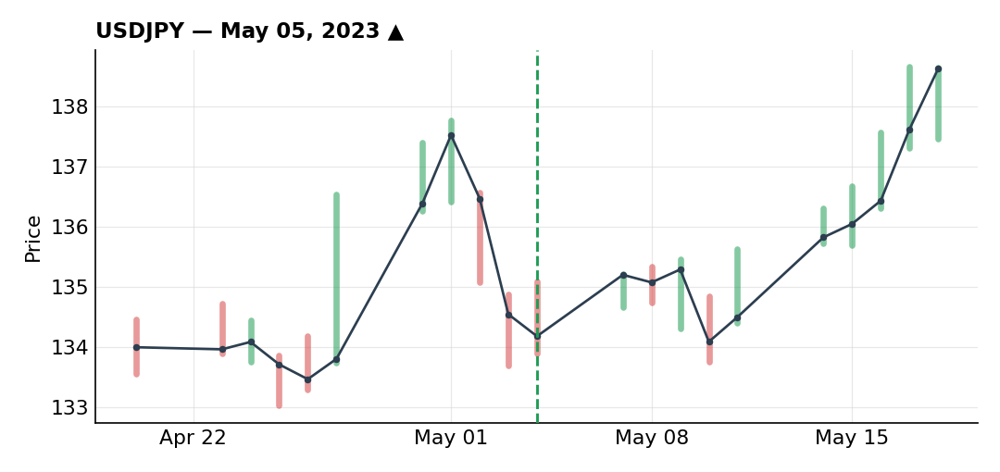
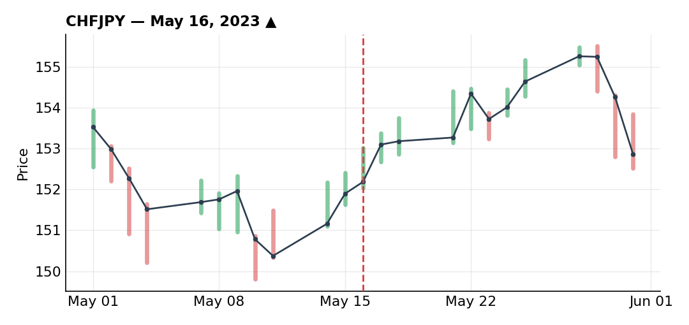

# May 2023

### An unremarkable USD/JPY long ahead of a soft CPI

***USDJPY** · long · closed · +0.90R · May 05, 2023*

I had a lot less free time for markets this month, and it showed in how un-technical this setup was compared to what I'd normally take. USD/JPY was in a nice uptrend, arriving at a fourth touch of a counter-trendline that formed a clean intersection, with a pullback into the 134.00 round number — the base of the initial move.

There was also a strong economic print (+2.6%) that had been quickly and fully priced back out, bringing price back to the level where volume had originally come in. I was betting on volume returning at that same price and potentially re-igniting the original upward move.

I got in directly on that re-pump without waiting for confirmation or a pullback, sized down to 75% of normal risk, so my stop was intentionally wide — a tighter stop just under the low would have been possible if I'd waited for a proper correction instead.

The trade worked initially, then went into a range. Heading into US CPI I trailed my stop more aggressively than I normally would have with price action this clean, because I didn't want to be exposed through the print. I noted a lower-high break — the end of the near-term downtrend — and would normally have waited for a pullback into a fib level before looking for continuation, but the CPI risk pushed me into a more defensive stance on my stops.

CPI came in soft for the dollar, price dropped, and it took me out at +0.9R. Not much more to say about this one — about as unremarkable a winner as I had all month.

### Full-risk CHF/JPY long, right call, ugly execution

***CHFJPY** · long · closed · -1.00R · May 16, 2023*

This was my worst trade of the month, and I'd still take it again without hesitation — nothing wrong with the decision itself. CHF/JPY was in a clear uptrend, pulling back into the 50 SMA, testing and retesting it, getting rejected twice. After that second rejection, a break of the recent highs confirmed buyers were stepping back in.

On top of that: a clean break of the counter-trendline, a further pullback into fib levels for a good entry price, and 80% of retail positioned short — which I read, as usual, as a contrarian confirmation of the bullish case. There was also a round number at 151.00 sitting right in the zone. With that many things lining up, I went in at full risk.

The trade moved in my favor first, then stalled into resistance around 152, failed there, and reversed — in hindsight, a pretty good reflection of how choppy the whole month was. Price came back under the recent lows, stopping me out, with genuinely ugly price action, before eventually resuming higher anyway.

Direction was right. Execution was just very difficult to pull off cleanly in that kind of market.

---

*-0.10R logged · 1W/1L*