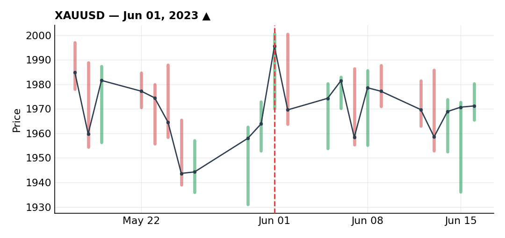
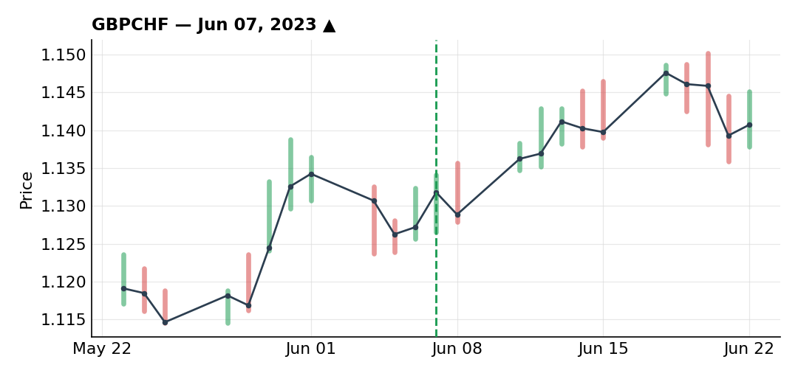
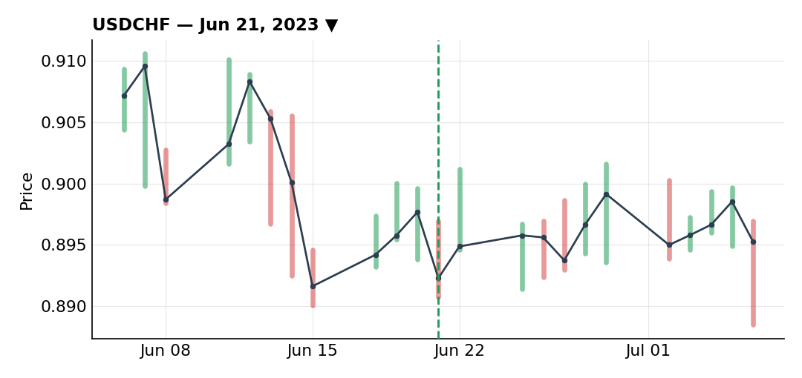

# June 2023

### Let XAU/USD ride on hope instead of a real thesis

***XAUUSD** · long · closed · -0.75R · Jun 01, 2023*

Gold was in an uptrend on the daily, pulling back into the trendline, getting rejected at the 50 SMA and fib levels — a technically interesting setup. On the 2H, a counter-trendline break signaled buyers stepping in, and I had limit orders sitting at the 50% fib that got filled almost exactly at the level I'd planned.

After the fill, price moved up first — seemingly confirming the read, and it was the first day of the month — then came back down, nothing unusual yet. But the market then went into a range, oscillating between a small loss and a small gain around my entry, and it's from that point that I had no objective reason left to stay in the trade. If I were looking at that price action fresh, I wouldn't have taken the entry at that price at all. Staying in the trade at that point was a bet on luck, not controlled risk management.

I should have closed at breakeven the moment that range invalidated the setup, drawn a fresh counter-trendline, waited for confirmation of a new bearish impulse and a pullback, and re-entered cleanly — that would have given me real buy confirmation instead of holding a position whose reason for being had already disappeared. I was distracted by other things going on outside of trading and didn't watch this one as closely as I should have.

Price rallied back into the range as I feared and stopped me out for -0.75R. Honestly, I was almost relieved to get punished for letting chance make the call — a useful lesson to sit with.

### Perfect GBP/CHF setup, ruined by snake-bite trailing

***GBPCHF** · long · closed · +1.25R · Jun 07, 2023*

I took a lot more purely technical setups than fundamentally-backed ones this month, simply because I didn't have the bandwidth to follow the macro news cycle as closely as usual. This trade is one of those. On the daily, a trendline had been tapped repeatedly — six or seven touches — before genuinely breaking, followed by a return to retest that level, now acting as resistance. On the 1H, a retest of that same trendline on the 50 SMA formed a double bottom right at the 61.8% fib — about as clean a confluence as I could ask for.

I waited for a proper break of the double-bottom neckline followed by a small retest before entering, which is exactly what happened, and executed on the small fib levels of that impulse. Setup and execution were both about as clean as it gets.

Where it fell apart was the trailing stop. Despite the clean setup, I managed it far too aggressively — after a rough May and an equally rough start to June, I just didn't want to give profits back to the market psychologically, so I tightened the stop much earlier and harder than the setup actually called for. There was a UK data release coming up, and unlike a later trade this month where exiting ahead of an event made sense, here I could objectively have given the position more room — a volatility wick wouldn't necessarily have stopped me out. I tightened anyway, out of that same defensive instinct, and it triggered my trailing stop and took me out in profit regardless.

The part I regret more: after that exit, price came back to retest the same neckline, and the whole setup was still completely valid. I should have re-entered with the same stop and target, which would have banked another +1.25R — but I didn't, again because I was gun-shy and had a lot going on personally. Setup and initial execution were perfect; my overall handling of the idea wasn't, for exactly those psychological and personal reasons.

### USD/CHF short ends the losing streak and flips June green

***USDCHF** · short · closed · +3.05R · Jun 21, 2023*

This is the trade that ended a rough stretch and flipped the month back into positive territory, so it's the one I want to remember in the most detail. USD/CHF had been in an uptrend, but then broke a series of rising higher lows — a sign of a reversal — and started a new downtrend. The daily candles showed a clear lack of upside momentum, in contrast to the down moves, which did have real momentum behind them. Price pulled back into the 50% fib of that down-impulse, which lined up with an old support-turned-resistance zone and, on top of that, the 0.90 round number — several confluences stacking in the same spot.

On the 30-minute chart, a counter-trendline broke and then got retested, and that retest happened right in my usual morning trading window — timing that felt about as clean as it gets.

I put my stop above 0.90 and set a target lower down. There was a US data release coming up, price was already close to a support level (raising the risk of a bounce), and on top of that event risk, I was already sitting on a meaningful profit after a genuinely rough stretch — this was clearly not the moment to play with fire. So I scaled out ahead of the release in five 20% tranches instead of holding the position through the announcement.

Ended up banking +3.05R through those staggered exits — a number I needed both financially for the month and psychologically, since it had been a hard stretch to sit through up to that point.

---

*+3.55R logged · 2W/1L*