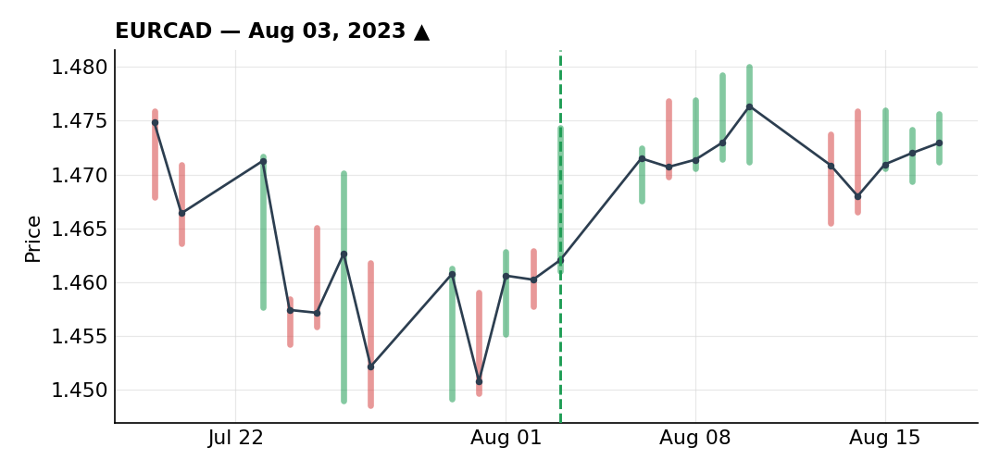
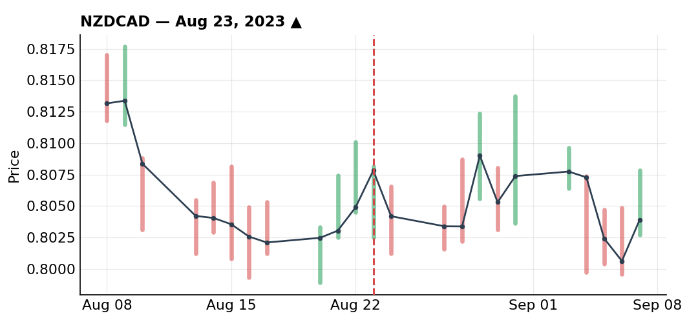
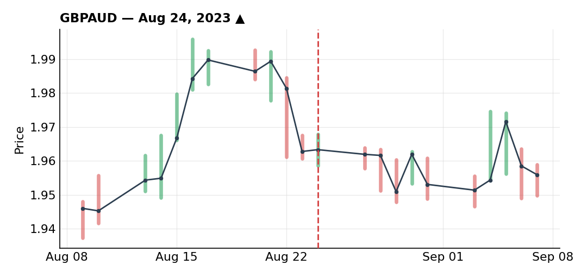

# August 2023

### Long EUR/CAD on oil topping out at resistance

***EURCAD** · long · closed · +2.28R · Aug 03, 2023*

The idea started with oil. It had ripped over 25% in a month and was sitting right up against $83 resistance, the kind of level where a lot of participants are going to want to take profit even without calling a full reversal. Oil is heavily correlated with CAD given Canada's exporter status, so a pause or pullback in crude was my reason to want to sell CAD. I expressed that as a long in EUR/CAD.

Technically, price was at a key support around 1.4500 — second rejection off that level — with a bullish RSI divergence starting to build. Retail was heavily positioned against me too, about 75% short, which is exactly what I like to see when I'm looking for a bottom.

I was waiting for a break of the recent highs to confirm buyers were back in control. Before that break confirmed, price dropped and filled what I'd actually placed as buy orders at the 50% Fibonacci retracement of the impulse, then reversed straight back up. Timing was about as clean as it gets.

After an initial pop (probably a macro headline), I took 33% off to lock in some profit — mostly because I was about to leave for vacation and wanted less risk on the table. Price kept grinding higher but without much real momentum, so I trailed my stop just under a recent low and got taken out for an average +2.28R.

My real target was higher, up near 1.4865 and beyond — I'd hoped to hold this the whole month for something like 4.5R with good management. Price did pull back toward my entry after the trail stopped me out, then took off again, and I never got back in — purely because I was traveling and out enjoying myself, not because the opportunity wasn't there.

### NZD/CAD long undone by poor management while traveling

***NZDCAD** · long · closed · -0.15R · Aug 23, 2023*

Same CAD-weakness-via-oil thesis as my EUR/CAD trade, but I couldn't find a clean way to reload EUR/CAD itself, so I looked elsewhere on the CAD crosses and found the setup on NZD/CAD instead.

Price was at a key support around 0.8000 after roughly a 5% drop over the previous month, with a bullish RSI divergence and a break of the recent lower highs — sellers who'd been defending around 0.8050 stopped showing up, and buyers started taking over.

I split this into two positions at half risk each rather than one full-size trade — one with a tighter stop for a better risk/reward, one with a wider stop behind the lows that would have been too loose on its own. Averaged together, my blended stop sat around the 0.8000 zone.

Price moved up as expected, but this was right in the middle of my time in London, catching up with a friend, and my attention to the screens basically fell off a cliff. I trailed my stop under a recent low; price came back and clipped it for -0.15R before continuing higher afterward.

The mistakes here were mine, not the market's. I never took the partial profit I should have at the 0.8100 rejection because I wasn't at my desk, just checking on my phone, and my stop management ended up in the worst possible middle ground — not tight enough to lock in the gain, not loose enough to let the idea play out. That combination is basically a guaranteed way to get stopped out at a bad price, and that's exactly what happened. Good idea, good analysis, bad execution — trading on vacation, with less discipline and the itch to make back what I felt I was missing, just doesn't leave room for the focus good management needs.

### GBP/AUD long stopped for -1R — the right trade, wrong outcome

***GBPAUD** · long · closed · -1.00R · Aug 24, 2023*

I wanted to be long sterling against something, and AUD was the obvious funding leg. The UK was, as far as I could tell, the only major economy still needing to keep hiking — inflation there was running far hotter than in the US, Eurozone, Canada, Australia or New Zealand, all of which had already stopped. Rather than short AUD outright, I expressed that as GBP/AUD.

On the daily, an already-tested zone broke higher, ran up toward the 2.00 area, then corrected back into a Fibonacci/trendline confluence around 1.96-1.97. On the 2H, same read as my EUR/CAD trade that month — bullish RSI divergence and a break of the highs, a sign buyers were stepping back in.

I got filled on buy-limits at that retracement, same approach as EUR/CAD, expecting the same kind of continuation. This time price just didn't cooperate — it turned back down and ran straight through my stop for a full -1R, no size reduction, full risk on.

I don't have any regrets about this one. If I ran it back, I'd take the exact same trade again. It belongs in the bucket of good trades that end badly, not bad trades that happen to work — and I try hard to keep those two categories separate in my head, because confusing them is how you end up repeating bad habits just because they got lucky once.

---

*+1.13R logged · 1W/2L*