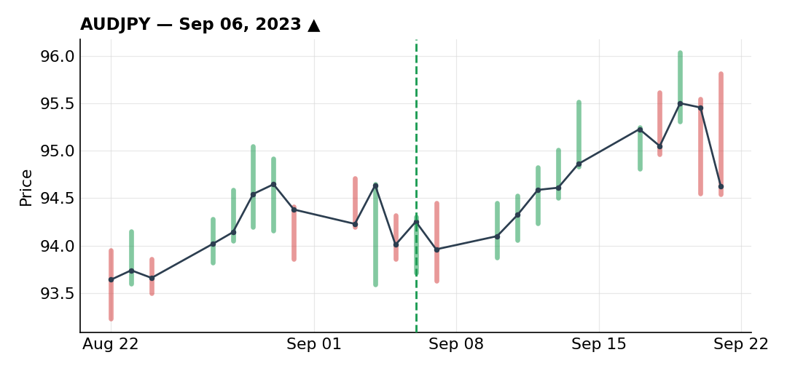
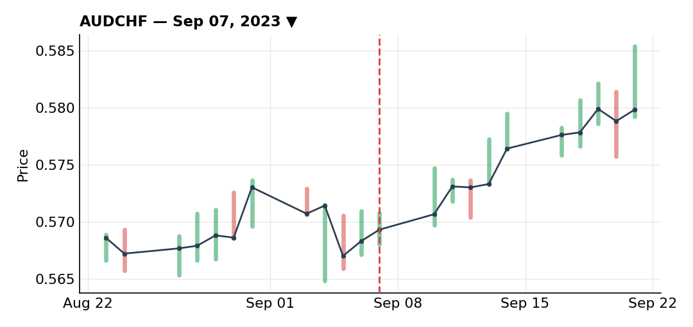
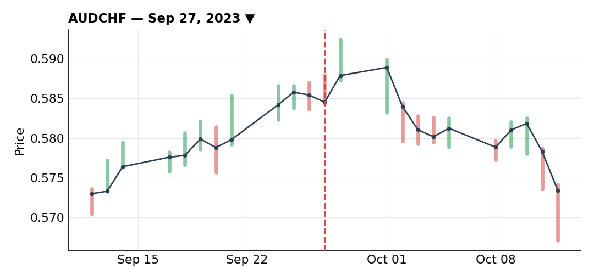

# September 2023

### AUD/JPY long off the RBA pause dip

***AUDJPY** · long · closed · +2.05R · Sep 06, 2023*

AUD/JPY had a clear underlying uptrend, helped along by a very weak yen. A trendline that had been touched four times — a genuinely strong one — finally broke, and that break also took out the prior lower highs, which told me real buying interest was showing up, strong enough to push through levels where sellers or profit-takers would normally show up.

I'd wanted to buy this breakout already, but held off because the RBA had a policy decision due and I didn't want to trade straight into that kind of event risk. The RBA paused rather than hiking again, which triggered a short-term AUD selloff — a read I understood (it signals the hiking cycle might be near its end) but didn't think should hold up longer-term, since Australia wasn't hiking alone anyway. The US, Europe and Switzerland were all pausing too, so there was no reason for AUD to structurally decouple just because of this one decision. That dip gave me the entry price I'd been waiting for.

Price consolidated on Fibonacci retracement levels after the drop, which let me get filled, then drifted back up. I started trailing my stop as it cleared successive levels. It eventually corrected lower — the S&P was also pulling back at the time — and that took out my trailing stop for +2.05R.

I think the trade and the management were both good; I just got unlucky in the short term, not the long term, which for me doesn't really exist in trading. My underlying view was still bullish (price was still above the trendline), so I put buy-limits back in at a Fibonacci level hoping to catch the continuation. They never filled, a few pips away, so I missed the rest of the move.

### AUD/CHF short as a hedge against my AUD/JPY exposure

***AUDCHF** · short · closed · -1.00R · Sep 07, 2023*

This was structurally a downtrend, driven by CHF strength as the safe-haven currency. A correction rejected beautifully off the 50% Fibonacci retracement inside a channel that looked about as clean as they come, then broke the prior higher lows.

The real trigger was a hedging need. Once the RBA decision was out of the way — the same one that had let me into AUD/JPY — the market's attention was shifting to Chinese data due that Friday. China is Australia's biggest trading partner, so that data was a direct risk to my long AUD/JPY position. Seeing a clean AUD/CHF short setup at the same time felt like the obvious answer: it let me put on a position I liked on its own merits while hedging my AUD/JPY exposure into that data.

Retail was heavily positioned long here too, around 91%, which fit the contrarian read. I got filled via sell-limits at the 50% level — the risk/reward wasn't great on paper since the logical stop above was fairly wide — and after an initial rejection price came back and triggered my orders. It just didn't continue in my favor and stopped me out for the full -1R.

I don't count this as a bad trade at all — it's one I'd take again if the same setup showed up. The loss just came from the setup not working this time, not from bad decision-making. And because this was a hedge against my AUD/JPY long, which ended up green (even if by less than I'd hoped), the loss here was effectively offset.

### Forced AUD/CHF short entry costs me -0.7R

***AUDCHF** · short · closed · -0.70R · Sep 27, 2023*

This was one of my last positions of the month, and honestly one I'd have been better off skipping. It's not a terrible trade, but it's not a great one either — if anything, borderline the worst trade I took this month.

Still on AUD/CHF, still in the broader downtrend. Price was testing a trendline zone that lined up with a 50% Fibonacci retracement and an old support level (dating back to May) that had flipped into resistance — a real confluence of reasons to watch the level closely, but not enough on its own to justify an automatic sell. Three near-identical daily closes in a row (open and close basically at the same price) were telling me the market was undecided here, not ready to turn.

On the lower timeframes I picked out a bearish divergence I'll admit was a bit forced — not crazy, but forced — while the trend on that timeframe was actually still up. A recent low had been broken, but only marginally, a pip or two, without a close below it. I decided that was enough evidence sellers were arriving and entered manually on the return to the 61.8% retracement — an entry I'd call not very clean.

Knowing this was an aggressive entry (decent risk/reward but early), I stuck to my usual rule of preferring to be a little late rather than a little early, and only took 70% of my normal size, planning to add the remaining 30% if price broke the trendline and came back to retest the Fibonacci levels while I trailed the stop.

In reality, price never decisively broke the zone I'd marked — a pip or two at most — which with a bit more patience should have kept me out entirely. Instead it kept climbing with no real sign of sellers taking over. I also had a risk-off overlay in mind: the S&P was falling, which should support CHF and pressure AUD, but I was ignoring that this kind of risk-sentiment effect on currencies mostly shows up when the VIX is elevated, and it wasn't — volatility was low, so that macro tailwind never really applied. I got stopped for -0.7R. The lesson was straightforward: I should have been more patient and waited for real confirmation before getting involved. The one thing that limited the damage was cutting size to 70% instead of going after it at full risk.

---

*+0.35R logged · 1W/2L*