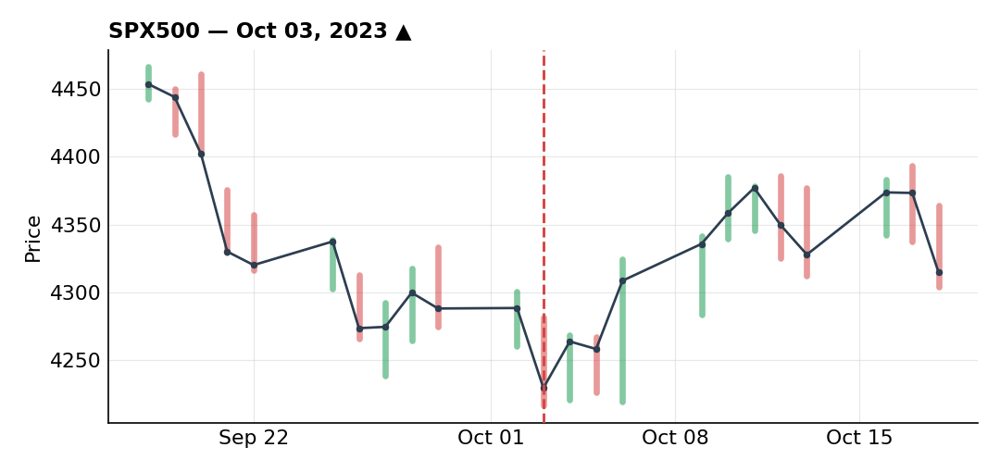
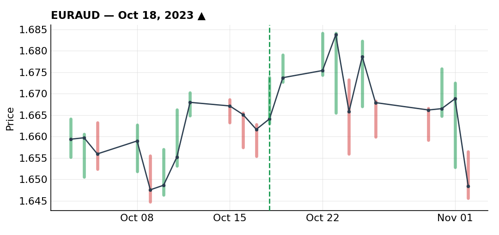

# October 2023

### Moved my stop on S&P 500 long and turned it into the year's biggest loss

***SPX500** · long · closed · -1.70R · Oct 03, 2023*

This ended up being my biggest loss of the year, and the reason is embarrassingly simple: I moved my stop. That's exactly the mistake I'd tell anyone else never to make, and it's a reminder that even with a decade in the market, the obvious mistakes are still there to make.

The setup itself had real reasoning behind it. Sentiment was extremely bearish — every outlet was negative on equities, and the Fear & Greed Index was showing extreme fear, which is usually a good time to be buying rather than selling. Seasonally, looking at 30 years of average daily returns, the S&P tends to run higher from January through July, weaker through August-September-October, then higher again into year-end — and the August-September move that year had tracked that seasonal pattern almost exactly. I was positioning for the turn I expected around the end of October.

The broader trend context supported it too — the index was up about 20% year-to-date and I was treating this pullback as a correction, not a reversal: an uptrend line with two touches and now a third, an ABC correction, a retracement of the impulse going back to March, landing right on Fibonacci support. On the fundamental side, the Fed's balance sheet was still enormous relative to pre-COVID levels — rate hikes are supposed to weigh on the economy and on equities in theory, but hadn't really done so in practice that year. Historically (2008, 2000) equity markets fall not when rates are rising but when they start getting cut, since that signals real economic trouble, and nobody was pricing in cuts for November or December, so my bullish view held.

I entered without waiting for confirmation, full risk, with a deliberately wide stop to give the position room given the longer-term thesis — I don't have a crystal ball for exactly where it bottoms. Price then moved in my favor, breaking the descending lows on the 4H. I wanted to add on a smaller pullback but couldn't add more risk since the first position was already full-size, so instead I trailed the first position's stop and set the add-in's stop at the same level — no reason to run two different stops — which in theory capped my total loss at 1R if it reversed on me.

Then I made the actual mistake. Price kept falling, with volatility and uncertainty but, as far as I could tell, no real reason behind the drop. My thesis still felt valid to me, and I didn't want to get stopped out on what looked like a spike, so I moved my stop again. That took the first position (which I'd trailed down to about 0.5R of risk) back up to full risk, and increased the add-in's risk too — I ended up with 1.7R on the table instead of the 1R I'd planned, which I wasn't fully comfortable with even as I did it.

From there, price kept falling on aggressive selling tied to bad geopolitical headlines (the conflict in Gaza), and at that point I couldn't justify moving the stop again — I took the loss. My unlevered long-term equity positions weren't touched by any of this; only the active, leveraged trading account took the hit.

What I should have done differently: respect the seasonality that pointed to a real October low and been more patient with my entries — better to be a little late into a trade than a little early. And instead of moving my stop when price broke the trendline against me, I should have hedged with an equal-size short, which would have capped the risk without making it unlimited, let me stay positioned for the reversal I still believed was coming, and let me close the hedge for a small loss once things turned rather than eating a full loss on the long.

### EUR/AUD long scaled into risk-off flows

***EURAUD** · long · closed · +2.50R · Oct 18, 2023*

Risk sentiment was turning off, and in that environment investors sell risk proxies like AUD. Selling AUD here meant buying EUR/AUD.

On the 4H, the longer-term trend was bullish. A counter-trendline broke to the upside as an early signal, price pulled back and carved out an inverse head-and-shoulders (the neckline break wasn't perfect, but close enough), with confluence from the 50 SMA, the broader flow structure, and the 50% Fibonacci retracement. Retail was heavily positioned against this move too — about 84% short — which fit my usual approach of leaning against the crowd.

I entered in two steps. The first was early, only 30% of my normal size, on a clean counter-trendline I hadn't even marked in advance — I wanted confirmation before committing more. After the break and a small retest, I added the remaining 70% at a worse risk/reward but with a lot more confirmation behind it, which is why the second entry carried the bigger size.

Management-wise, price hit the top of a rising wedge going into a Friday — I thought about taking profit there and didn't. The following week I trailed my stop progressively higher. European PMI data released overnight shifted the risk tone, price turned back down and stopped me out overnight for +2.5R total. Good trade — a lot of reasons and confluences lined up to be long here.

### The AUD/CHF short I never got filled on

***AUDCHF** · passed on · 2023-10*

This one ties into the same risk-off logic as my S&P 500 thinking that month — risk-off flows hit proxies like NZD, AUD and CAD, and benefit havens like CHF and JPY. AUD/CHF pairs a risk-on currency against a risk-off one, which made it an obvious place to look for a short.

On the daily, the structure was a clean downtrend of impulse and correction — a broken trendline getting retested right into a resistance confluence. On the 1H, that resistance got rejected with a bearish divergence and a break of the recent higher lows, which is exactly the confirmation I look for before hunting a short. Retail was heavily long here too, about 82%, another argument in favor of fading it.

The analysis turned out to be completely right — AUD sold off hard, CHF got bought as a haven, and AUD/CHF reached the level I was targeting. But the small pullback I needed to get filled on a sell-limit never came. As price kept falling I kept lowering my Fibonacci retracement levels chasing the entry, and never got filled.

Perfect setup, no execution. I did ask myself whether I should have just entered at the level I was watching it from, and the answer was no — the risk/reward wouldn't have made sense. I had two or three situations like this in October: setups that played out exactly as expected but where I either missed the execution or would have needed to enter too early for it to make sense. It's a good reminder that fundamentals give you the direction, but timing is the hard part, and that's what technical analysis is for — managing entries and risk. If I'd caught this one, October wouldn't have closed negative, which says something about how much execution discipline — actually being there to take the trade — matters as much as being right.

---

*+0.80R logged · 1W/1L*