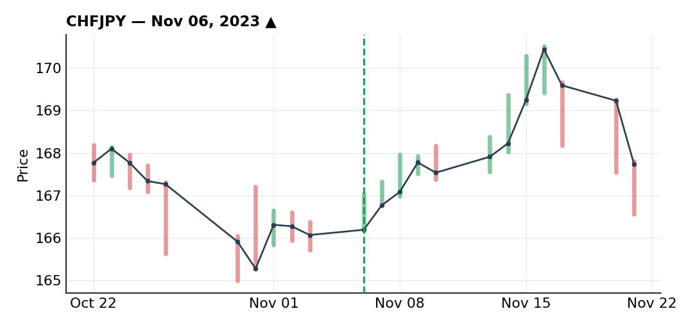
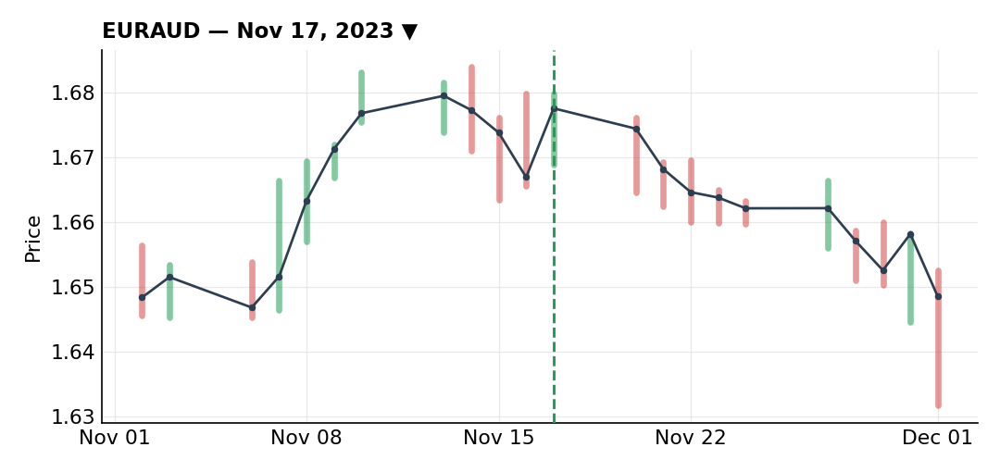
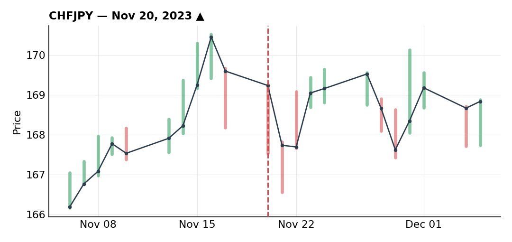

# November 2023

### CHF/JPY long finally triggers after a month of waiting

***CHFJPY** · long · closed · +2.75R · Nov 06, 2023*

I'd wanted to buy CHF/JPY for about a month at that point, going back to October, but I'd never gotten price action clean enough to put together a good stop, target, risk/reward and timing all at once. The direction was never really in question for me — only the execution was missing.

Retail was heavily positioned against me, around 85% short, right as I wanted to buy. Seasonality was also strongly in my favor — averaging the last 5, 10 and 15 years, November and December have historically been exceptionally strong months for this pair. On the daily, the uptrend was clear; a daily trendline had just been rejected, with a counter-trendline forming, and the break and retest of that counter-trendline is what finally gave me the reasons to pull the trigger.

I used a relatively tight stop rather than a wide one — my reasoning was that with nearby Fibonacci levels and a daily trendline that had been tested repeatedly, the odds of a sudden drop back to retest it within the next couple of hours were low, especially with no economic data due. I got filled around the 170 area. I sized this at 60% of my normal risk rather than the 50% cap I'd been running through my drawdown — the biggest size I put on all month — because the fundamentals, technicals, seasonality and contrarian retail positioning all stacked in the same direction. I'll admit I wanted to go full size and held myself back.

Price moved up as expected toward an old resistance near 170. After a run of losses I was tempted to just cash out there, but the seasonality argument — which holds for all of November and December — plus the still-bullish structure convinced me to stay in. I pulled my initial 170 target and moved it up toward 171, figuring there was still room given the seasonal tailwind, then trailed my stop aggressively before going to sleep so I wouldn't be caught by anything overnight. I woke up stopped out on a retracement, exit at 170.250, for +2.75R.

I wouldn't change much here — maybe I could have added on the retest with a stop behind the 50 SMA or the trendline to squeeze a bit more out of it, but overall this is one of the cleaner trades I've run in a while.

### Fundamentally-driven EUR/AUD short against the technical grain

***EURAUD** · short · closed · +1.40R · Nov 17, 2023*

AUD had recently dropped after a rate decision from the RBA that the market read as dovish. The hike itself was fully priced in and changed nothing, but the statement dropped the line about continuing to raise rates based on incoming data, and that omission was read as dovish, pulling AUD lower and pushing EUR/AUD higher.

I didn't buy that read. Comparing inflation, the Eurozone was running around 2.9% against Australia's 5.4% — nearly three times its target — which told me there was a lot more room for the RBA to keep hiking, and for AUD to strengthen, than there was for the ECB, especially with European manufacturing and services PMIs coming in weak and taking pressure off the ECB to keep tightening. That gave me a case for buying AUD, which meant selling EUR/AUD.

I also looked at the DE10Y-AU10Y yield differential, which normally tracks EUR/AUD reasonably closely. It was decoupling — the differential falling while EUR/AUD kept rising — a mismatch between bond yields and the FX price that reinforced my conviction to sell.

Technically this was a hard trade to like. The daily trend was clearly bullish, with a trendline tested multiple times, and I'll admit it felt a little dumb wanting to sell into that. This was about as close to a pure fundamental trade as I take, working almost directly against the technical picture. Dropping to the 2H to refine an entry, I saw resistance tested, an initial rejection that wasn't enough on its own, then a double top followed by a break of that double top and a counter-trendline — enough to give me an execution opportunity, though the setup still looked messy enough for a sell that I waited for further confirmation on the 15-minute and 5-minute charts before pulling the trigger.

I scaled in. The first execution was only 25% of my normal size, given how much this fought the technical trend. A few days later, price failed to make a new daily high — a reversal signal that confirmed my read — so I added the remaining 25% to get back to my drawdown-adjusted full size of 50%, with a fairly wide stop behind a multi-touch trendline, the SMA and the last high.

My initial target was the direct support level, but I raised it to account for a rising daily trendline that could act as intermediate support. With risk events coming up on both EUR and AUD, and wanting to lock in gains heading into month-end, I set a zone in advance where I'd either watch price closely or just get out. Price reached that zone and I closed both the initial position and the add-in manually, closing out my month on this one. At full size this would have been worth about +2.8R, but since I only ever committed 50% total risk across the two entries, the realized result was +1.4R.

### Chased the CHF/JPY retest and paid for it

***CHFJPY** · long · closed · -0.50R · Nov 20, 2023*

Right after getting out of my first CHF/JPY long, price kept falling aggressively and came back into a resistance I'd already marked, with a daily candle confirming the rejection and lining up with the 50% Fibonacci level — a setup that was tempting me to buy back in.

I hesitated at first. The trade fell right before a weekend, and I wasn't in a rush to add exposure going into it. More importantly, a stop placed just under the wick gave a poor risk/reward, since price could easily run up to the 50 SMA and test the trendline without actually invalidating the idea (it would have stayed above the 61.8% retracement). So I decided not to execute right then, planning to wait for a deeper pullback into the trendline instead.

That's where I made my timing mistake. There was a small bounce, then a fresh drop back to the trendline. Off the back of two consecutive winners that month, and eager to finally catch this move, I jumped in as soon as price touched the trendline/50 SMA/Fibonacci confluence, without waiting for the lower-timeframe confirmation I'd normally want. There was real emotion driving that entry — I should have dropped to a shorter timeframe and waited for an actual reversal signal and a clean setup instead of buying the mere touch of the trendline.

Price kept falling with no reaction at the level I was expecting one, the confirmed buy signal on the lower timeframe never showed up, and I got stopped for -0.5R. I kept my seasonality conviction on the pair going forward regardless — this was a timing mistake, not a change in thesis.

---

*+3.65R logged · 2W/1L*