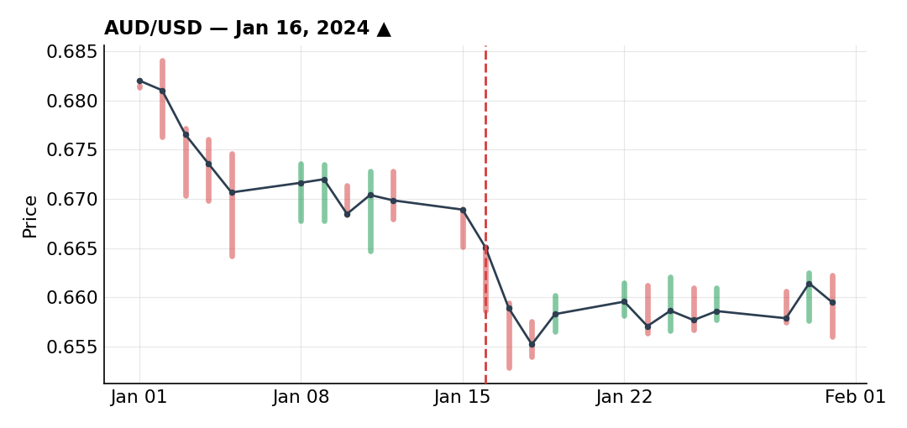
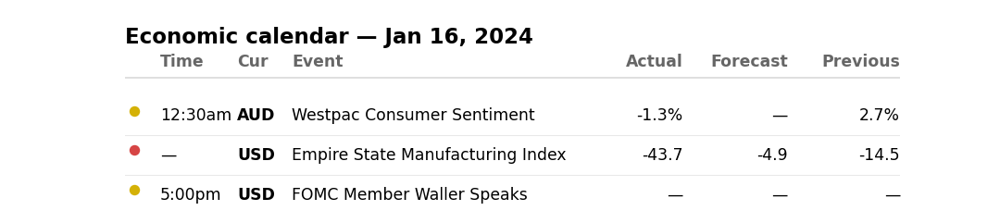

# January 2024

### Closed AUD/USD early rather than trade on hope

***AUD/USD** · long · closed · -0.05R · Jan 16, 2024*

This one continued the same idea behind a position I still had open at month-end (+0.12R floating, an extremely similar setup). Back in December, on a daily downtrend, I was already bullish AUD/USD on fundamentals bearish for the dollar and bullish for the Aussie, and chose not to sell into a resistance, betting on a break higher instead — that call played out.

The problem with January, in a nutshell, is that this kind of clear directional conviction was basically missing all month. Coming off December's breakout, AUD/USD had come back to retest the broken trendline, a still-intact uptrend line, and the 50-SMA. The AU10Y-US10Y yield spread was climbing while AUD/USD was falling — a short-term decorrelation I read as a reason to buy at these levels.

Entered without waiting for any reversal confirmation, stop behind a low that looked reasonable. Price kept falling, tagged a support close to my stop, then turned back up — the support held, with a countertrend line starting to form. I'll admit neither the entry nor the risk/reward on this one were anything special.

The real moment worth logging: after the countertrend line got rejected once and price came back to test it again, I caught myself one morning at my screens hoping the support or the trendline would hold, rather than reacting to what price was actually doing. That's a state I never want to be in again — the rule is trade the reaction, never the hope.

So instead of sitting in a hope trade, I closed it early, essentially at breakeven (actual result -0.05R) — no reason to hold a long "on hope" when I could re-enter with real conviction if the breakout actually confirmed. AUD/USD did break higher shortly after, and I re-entered at close to the same price. Financially it barely mattered either way, but the bigger point stands: exiting a hope trade to re-enter on conviction is the right process, not sitting there hoping.

**Economic calendar that day:**

### Two 0.5R adds into CHF/JPY that both got stopped — worst risk decision of the month

***CHF/JPY** · short · closed · -1.00R · 2024-01*

The SNB has a track record of intervening to weaken the franc, and had recently signaled it wasn't happy about the currency's continued strength. On the other side, the BOJ was one of the only developed-market central banks still on a hiking path (rates still at -0.1%, with a possible exit sometime in 2024), while the Fed, ECB, BOE, and SNB had all already hiked over the prior 18 months — a pendulum effect I expected to eventually put a bid back under the yen.

Supporting signal: the CH10Y-JP10Y yield spread was falling even as the franc kept rising and the yen kept falling — that decorrelation reinforced the bearish view on the pair. Technically, a weekly indecision candle, then on a shorter timeframe a bearish divergence plus a rising wedge — a break lower would combine a fundamental catalyst with technical confirmation. Price did break down.

First execution was only 0.5R — sized down because retail sentiment showed 90% of retail already short the pair, and being on the same side as that big a majority made me uneasy. Price then came back against me to retest a small broken trendline and got rejected again; knowing I'd already taken three 0.5R losses in January, I decided to add another layer on this idea (a fresh divergence supporting it), re-executing another 0.5R close to my first entry with a tight target, hoping to lock in a move and get back to breakeven quickly.

Instead, price came back to retest the same range that trapped basically the entire month, and both pieces got stopped for -1R total. Two mistakes worth logging here: first, I sold near the support of a rangebound, directionless market instead of near the top of the range, which would have given me more room — especially since, by my own read, even the big institutions had no real direction that month. Second, I put on full risk (0.5R + 0.5R) despite 90% of retail already being on my side of the trade; in hindsight I shouldn't have gone past 0.75R total on that basis alone, even with high conviction. The idea itself I still think was sound — it was the sizing that was the real error.

### GBP/NZD scratch at breakeven — the best result of a rough month

***GBP/NZD** · long · closed · +0.00R · 2024-01*

A UK PMI print had come in better than expected, giving me a mild bullish bias on sterling. Technically, daily was in an uptrend with a recent breakout higher; price hadn't quite reached a resistance level yet — if it had gotten there along with bearish divergence I wouldn't have been interested, but the fact it hadn't fully tested that level made me want to target it. There was also a bullish wedge that got rejected after a sixth touch on the upper line.

On a closer look I read that rejection as just a correction within the uptrend rather than a genuine rejection of resistance — a channel where price, after tagging the upper line repeatedly, failed to come back down to the lower line and broke higher instead.

I wanted to buy targeting the highs, with a deliberately wide stop — not wanting, this late in an already bad month, to get clipped by noise on a tight stop. So I waited for a pullback to fib levels / a retest to get a decent price without pulling my stop in tighter.

Price came back and retested the broken trendline almost perfectly; I executed with a stop behind the lows, targeting the highs. Market then went right back into the same flat range that defined the whole month. Held over the weekend, moved my stop to breakeven under a small consolidation, hoping to finally land my first positive trade of January. Overnight, price dropped and took me out right at breakeven — my best result of the month, even if it wasn't a winner.

---

*-1.05R logged · 0W/2L*