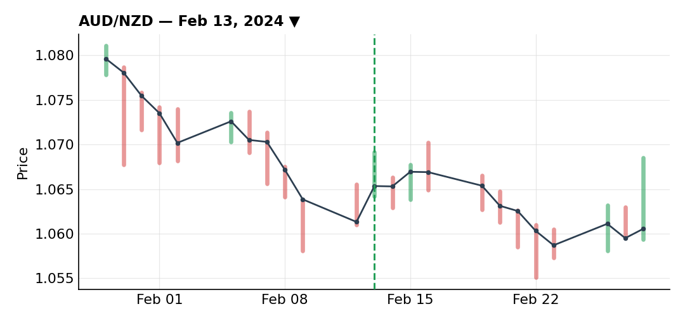
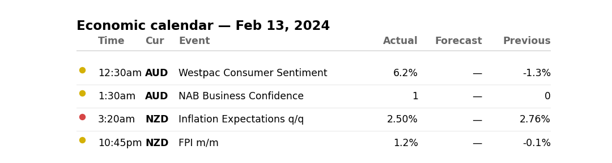
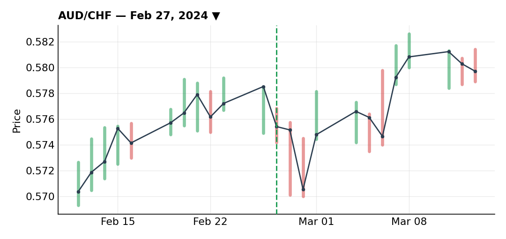
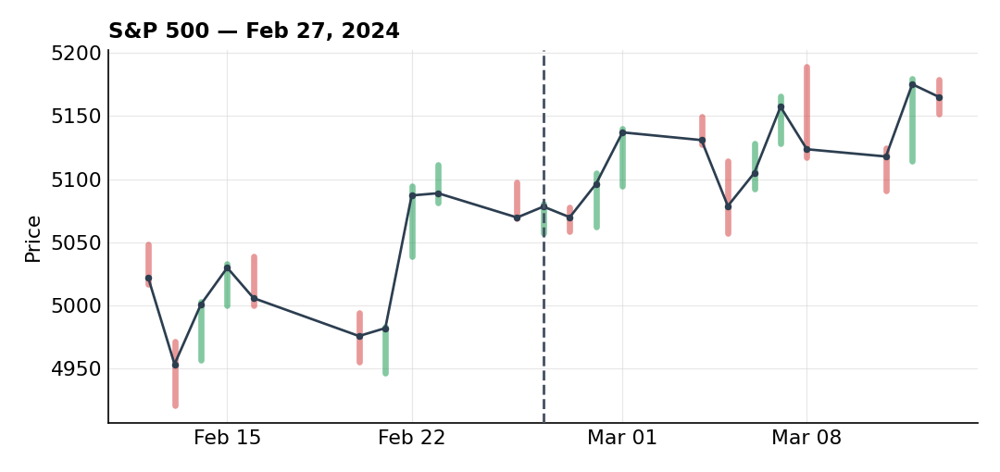
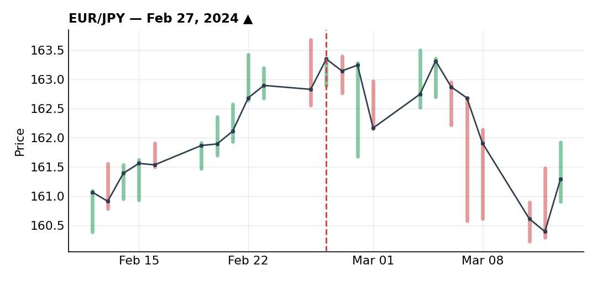
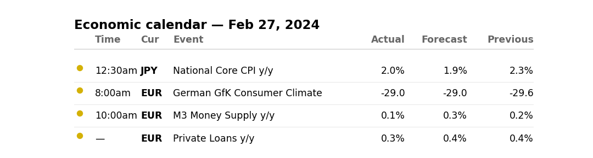

# February 2024

### AUD/NZD short into an employment divergence — a two-week, three-exit trade

***AUD/NZD** · short · closed · +1.37R · Feb 13, 2024*

AUD/NZD had been stuck in a big triangle since 2023; more recently it wasn't even reaching the top of that triangle anymore, with a smaller triangle forming inside it — a sign of building bearish pressure. Support had already been tested four times; a fifth test would normally pull in a wave of retail buyers, but the fundamental picture had shifted underneath it.

Australia and New Zealand run closely linked economies, so this pair mostly trades on the divergences between the two. New Zealand employment data had just surprised to the upside — a strong labor market being a hawkish signal for the RBNZ, opening the door to an earlier hike — while Australia hadn't shown the same strength yet. That divergence is what put me on the sell side.

I didn't have a clean technical trigger right at the support break, so I let it happen without trading it and waited for the pullback to the old support-turned-resistance, looking for an entry that lined up both technically and fundamentally. Australian employment data was due the next day; my logic was that if the initial move came from good NZ data, weak AU data would only widen the divergence further.

First sell-limit filled a touch early relative to the ideal retest level — wide stop above a recent high, 0.5R risk, two days ahead of the AU print. Plan going in: add if the data confirmed, hold with the wide stop if it came in neutral, or trail the stop and get out if AU employment came in strongly positive. 83% of retail was long at that resistance level too — another contrarian confluence in favor of the short. My rule on data trades is simple: cut fast if it goes against you, let it run if it goes your way.

AU employment came in negative, outside the range of economist forecasts — thesis confirmed. Price had already moved some before I could get my add-in filled. Mechanically, I trailed my initial stop to cut that position's risk in half (freeing up 0.25R), then added 0.25R at the new, tighter stop distance — total risk on the table stayed the same. For the stop level, resistance sat around 106.90; rather than a too-tight stop right above it at 106.98, I placed it above the round number at 107.00, since orders tend to cluster there.

Price dropped to a first support; the speed of the move didn't look overstretched, more a pause than a reversal. Looking closer, I saw a low followed by an impulse breaking the prior low without pulling in more sellers — a negative tell — then a correction into what looked like an inverse head-and-shoulders on the fib levels, plus a possible bearish RSI divergence I hadn't marked at the time. Given that cluster of correction signals, and still a bit shaken from clawing out of January's drawdown, I locked in 50% here.

There was event risk the following week — AU CPI (the same data behind my AUD/CHF trade) and an RBNZ decision only 30 minutes apart, a real volatility cocktail. After the 50% close, price kept dipping briefly without ever validating the inverse head-and-shoulders (didn't worry me), then bounced and started correcting higher — normal profit-taking from everyone positioned like me ahead of that news. In hindsight I wish I'd taken more size off the table the week before, knowing that stretch was coming.

Closed another 25% ahead of the CPI print, since I was also managing the AUD/CHF trade around the same release and wanted to trim overall exposure, leaving the final 25% with a trailed stop. AU CPI came in negative as expected, no need to touch the remainder; it was the RBNZ decision — more dovish than expected — that finally triggered the trailed stop on the last piece, as a lot of traders long NZD on the same divergence thesis had to unwind. Three-stage exit (50/25/25) for +1.37R total on half-size risk. Not a huge number, but the trade is worth logging for the management alone — two entries (initial plus a stop-trailed add) and three separate exits over a two-plus week hold.

**Economic calendar that day:**

### AUD/CHF short into the CPI print — the last profit, and best trade, of February

***AUD/CHF** · short · closed · +2.40R · Feb 27, 2024*

AUD stayed structurally in favor as a carry currency — high rates pulling in buyers, unlike funding currencies — with the RBA holding a more hawkish tone than most other central banks, including the Fed, as long as Australian inflation stayed elevated. That's what had been driving AUD/CHF's uptrend since early February. Broader backdrop was risk-on too — the S&P was ripping higher that month, pushing flows toward risk-on assets like AUD and away from safe havens like the yen.

The catalyst was the Australian CPI print. Two scenarios: if it surprised higher, that would only reinforce the crowded long-AUD positioning — in that case my preferred setup would've been a EUR/AUD short instead (kept in reserve, never executed). If it came in lower than expected, that would call into question the "Australia has structurally high inflation" thesis propping up all that AUD length — a disavowal I expected to unwind more violently given how one-sided the positioning was. That's the scenario I wanted and was positioned for.

Technically, AUD/CHF had been in an uptrend since early February with two rejections off resistance, then a break of the uptrend line and a support — sellers taking control. Correction into fib levels afterward gave a confluence I liked. I didn't want to target too big a move here since I have no interest in holding CHF long-term — the SNB was one of the only developed central banks flagging a possible cut as early as March, so bearish CHF on a medium-term view. Target was simply the MPO off a double top, nothing fancier.

Consensus for the CPI was 3.7% against a prior 3.4%; my decision rule was that a print at or below 3.4% would confirm the sell. It landed exactly at 3.4%. Executed during the release, around 7pm, stop behind the highs — not the absolute high since I couldn't get positioned ahead of the print. Price dropped and kept dropping overnight, letting me trail the stop with no overnight-squeeze risk given the size of the move. Woke up around 6:30am to find the target already hit — no need to tighten the stop, which might otherwise have gotten me out early on a retracement.

Small position, half risk, but a very clean risk/reward — a satisfying way to close out February.

**What the trade thesis pointed to:**

### EUR/JPY long got greedy on the add — worst trade of February

***EUR/JPY** · long · closed · -0.50R · Feb 27, 2024*

Went into this one "really confident," and it was exactly that overconfidence that ended up amplifying the loss.

86% of retail was short the pair, and that short volume kept growing — following my usual heuristic that most retail ends up wrong, I wanted to buy against the crowd. Technically, a correction had just played out, supported three times by the 50-SMA, plus a small trendline and a fib confluence off the prior impulse — a setup I genuinely liked.

Entered without waiting for extra confirmation, on the second rejection off the trendline (the first rejection wasn't enough on its own), stop behind the prior low, targeting the highs. I considered closing early given it was near month-end, but my real target was further out. Fundamentally, EUR/JPY's uptrend was being carried by structural yen weakness (the only major developed economy still at negative rates) and the carry trade — a long EUR/JPY position earns a positive nightly swap, which pulls in real capital and weighs on the yen. Broader risk-on backdrop too, with investors buying equities and selling the yen as a safe haven.

I chose a wider stop than necessary given it was month-end, when unusual price action can show up even without scheduled news. A small correction along the way was tied to a Japanese CPI print that came in around 2%, below whatever I recall expecting (my memory on the exact expected number isn't reliable) — didn't change the underlying narrative on the BOJ or the yen, so I read it as a buying opportunity.

Price then rose as expected, broke a high, corrected again, broke a countertrend line, and came back to fib levels — with conviction building, I decided to add. To stay under my 0.5R total risk cap, I had to trail my stop first before adding size. Executed the add via a buy-limit at the 50% retracement, stop trailed just behind that level — total risk on the table stayed at 0.5R despite the larger position.

Overnight, price dropped to the stop and then bounced — ugly price action. Stopped out for -0.5R. Some of this loss came down to getting greedy with the add, but if I'm honest, I'd do the exact same thing again — trailing the stop to add without raising total risk has paid off for me plenty of times before, like on the AUD/NZD trade above.

**What the trade thesis pointed to:**

**Economic calendar that day:**

---

*+3.27R logged · 2W/1L*