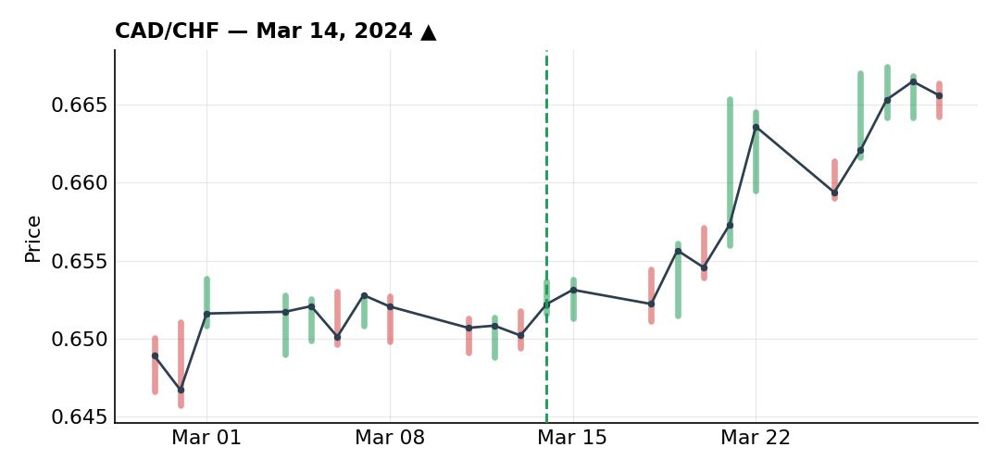
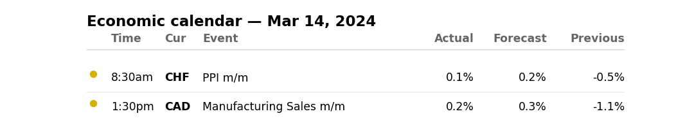
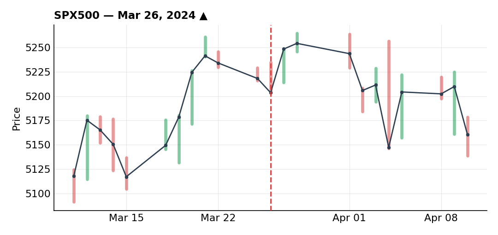
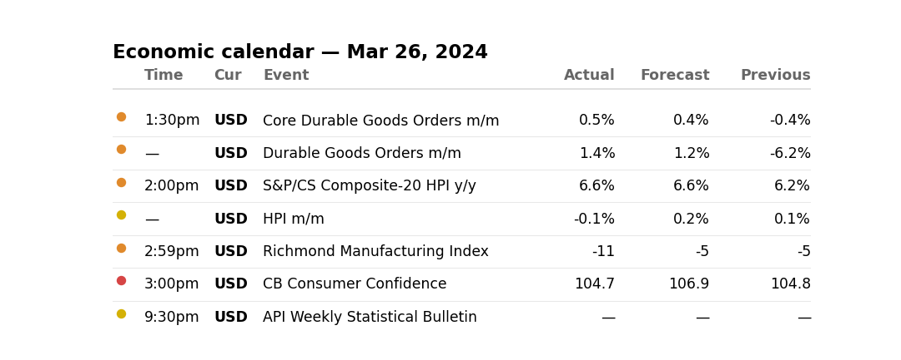

# March 2024

### CAD/CHF long into an SNB rate cut — best trade of March

***CAD/CHF** · long · closed · +1.62R · Mar 14, 2024*

CAD/CHF had been in an uptrend since the start of the year, with a break of resistance around 0.6500. On the chart: a clean, well-respected uptrend line, a countertrend line touched three times before breaking, and an inverse head-and-shoulders — an impulse off the trendline, a flat correction, then another leg up. Same read on the daily, with a series of higher highs broken one after another — buying flow that looked about as clean as it gets.

Fundamentally, CHF looked bearish since the SNB was one of the only central banks signaling rate-cut expectations — that's the fundamental thesis that ultimately let this trade run to target.

Despite how obvious the setup looked, 71% of retail was already positioned long — a crowd I don't like being on the same side of. Sized down to 60% (not 50%, since retail wasn't quite above 75% either). Entered after the countertrend line broke and got retested, stop behind those levels and behind the trendline — didn't widen it further, figuring I'd exit on my own read if the trendline broke rather than needing the stop to do the work.

One real mistake here: Canadian CPI landed on a Wednesday while I was still in the position — a variable outside my control. I should have trailed my stop ahead of that release to lock in profit in case of a sharp drop, but didn't, for personal reasons (childhood friends visiting Panama). A mistake, though ultimately harmless — I figure I could have banked around 0.6R there and then re-entered, possibly at full size if retail positioning had eased by then.

After the CPI, price retested the trendline levels multiple times (up to a fourth touch on a resistance), which could easily have triggered the urge to lock in profit out of fear of getting caught out again — something I've been burned by at this exact kind of level before. But the price action read clearly bullish to me (a sharp rejection quickly reabsorbed rather than followed by chop), so I took no partial profit ahead of the breakout.

Price eventually broke those levels, and then the SNB delivered the rate cut as expected — the fundamental idea behind the whole trade — which sent price straight to target for +1.62R. The only real error was not trailing the stop ahead of the Canadian CPI, which probably cost me the difference between a 1.6R and a 2.2R outcome.

**Economic calendar that day:**

### NZD/CAD long sized down three times — still the best R-on-risk of the month

***NZD/CAD** · long · closed · +1.15R · 2024-03*

I'd flagged this pair before, back in December, when I tried a similar long and got stopped out on a wick. Since then I'd been tracking an impulse, a correction, a break of levels and a retest that made sense both fundamentally and technically. Price then went into a longer consolidation than I expected, which is what got me out of the position back then.

This time, technically: a correction to the 50% fib, an inverse head-and-shoulders, a break higher, then a retest of the neckline and the 50-SMA — a level I consider very important. Daily gave a clean buy opportunity; 4H read the same way, with the neckline broken and retested, plus an extra trendline on the 1H — confluences stacking up nicely.

What kept me from going full size: this bullish bias was partly a reaction to a sharp recent drop that had wicked a lot of retail traders out of their positions — the same kind of move that had gotten me in December — which made me cautious on sizing. On top of that, there was a Bank of Canada rate decision the next day after I'd want to enter — real event risk to manage around.

Sized down twice over: the setup was good both fundamentally and technically, but retail was heavily long (85%, not 65%), which alone would've had me trim to 60%. The added uncertainty from the BoC decision the next day pushed me down further, to just 30% risk executed. The explicit plan was to wait out the rate decision and add if it confirmed my view.

On a lower timeframe I caught a reversal at the key levels — an impulse off the trendline slightly breaking a high before rolling back down — and executed on a 61.8% fib retracement. The BoC decision brought some volatility but nothing that changed anything, and price continued as expected. My one real mistake here: I never got around to the add-in I'd planned, even after getting the exact confirmation (a genuine impulse plus a retest on the fib levels) that would have supported it.

Canadian and US data (the NFP) landed at the same time on a Friday, which spiked price toward my target while making risk management messier — I wasn't sure where to put my stop, since it was still sitting just below the pre-announcement level (already trailed earlier in case things went my way). Decided to cash out 50% of the position (15% risk on the original 30%) — limited in R terms but a solid risk/reward. With roughly 0.15R left on the table on a Friday, holding felt like more of a mental tax than an actual factor in my year, so I closed the rest and trailed the stop aggressively on the way out.

Ended up +1.15R total on just 30% risk executed — in hindsight I could have run a lot more size on this one, which stings a little looking back. Between personal trips to Panama and time spent on crypto (which went very well that month), March ended up a bit light on FX opportunity relative to what was actually available — a trade-off I'm fine with.

### SPX500 long stopped fast on the first attempt

***SPX500** · long · closed · -1.00R · Mar 26, 2024*

The S&P had been in a strong uptrend since around September/October of the prior year, and I'm also positioned in it directly through my long-term investments. In this kind of environment, basically any economic news gets read as bullish for equities — higher-than-expected inflation is bullish for the dollar (rates staying higher for longer, a sign the economy's fine), but by the inverse logic, lower inflation is also read as bullish for equities (rate cuts and stimulus ahead). Net effect: in a trend like this, I don't look to short the S&P — the trend is the trend.

Technically: a rally, then a correction inside a channel, with a small inverse head-and-shoulders that first failed to make a new low, then broke and retested. I couldn't act on it in real time since it happened overnight while I was asleep. Price kept climbing, then corrected into fib levels and a support, where I placed buy-limits to get with the trend.

Orders filled, then price dropped to take out the lows before turning back up — a move that didn't actually invalidate the broader idea (the channel had broken, been retested, and the trend was resuming), but I'd deliberately taken an aggressive entry with a tight stop, and that stop got hit. -1R, full risk.

**Economic calendar that day:**

### Reopened the SPX500 long with more room — still running

***SPX500** · long · still open · +0.65R floating · 2024-03*

After getting stopped out, price started climbing again, so I got back in — same idea, this time with a wider stop. It's worked well. The day before writing this, I closed 50% of the position at a fresh all-time high; the other half is still open, and I'm expecting new highs into early April.

I don't usually trade the S&P with leverage much, since I'm already invested in it long-term. The reason I did this month is partly that the setup was technically clean, but mostly because FX had been unusually flat that week, with a pile of central bank announcements landing all at once and creating a lot of noise without a clear direction. Rather than guess at an FX direction I didn't have real conviction on, I went with the setup that looked more obvious to me on equities. This was a big loser on the first attempt, but it's a trade I'd take again without hesitation — the broader thesis on the S&P was never actually in question.

---

*+1.77R logged · 2W/1L*