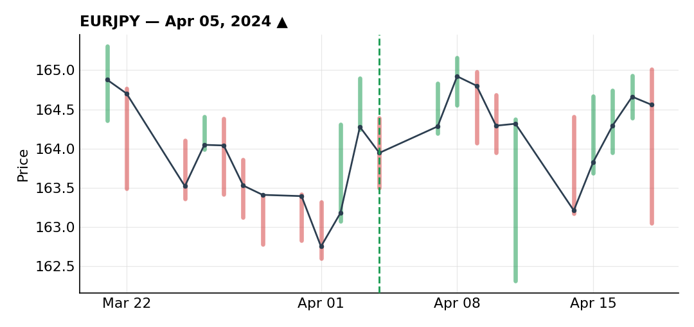
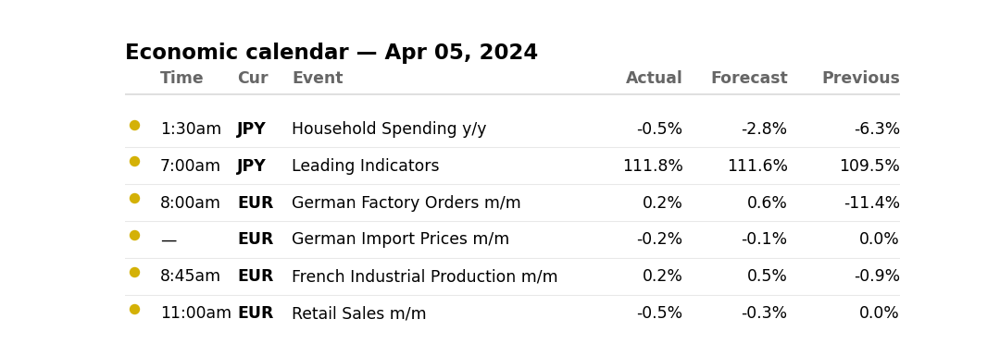
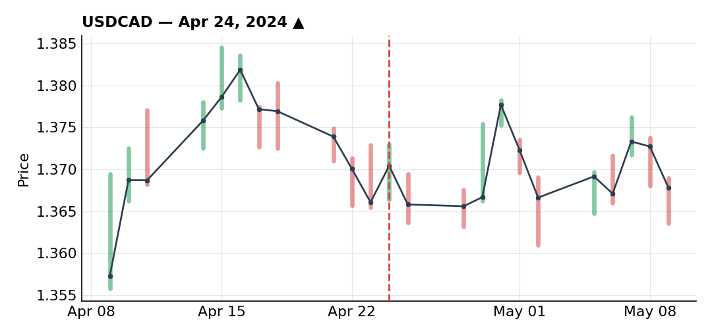
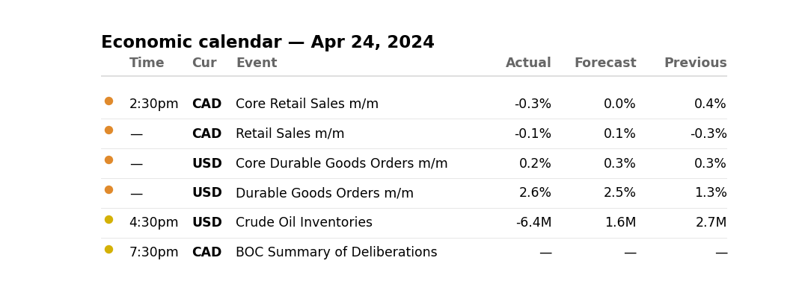
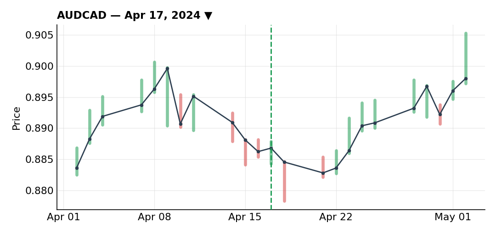
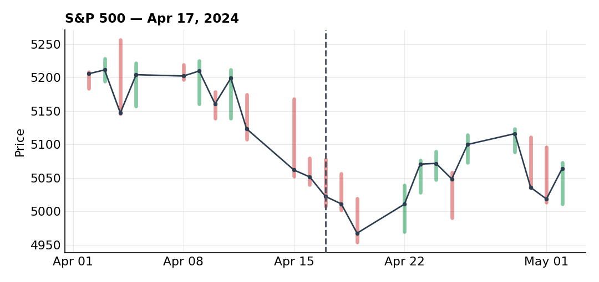
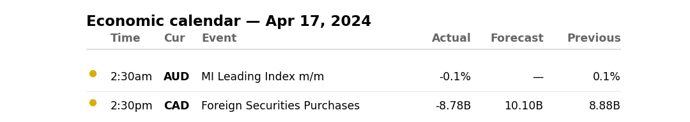

# April 2024

### Re-entering EUR/JPY long after the Iran-Israel news flush

***EURJPY** · long · closed · +3.60R · Apr 05, 2024*

This was actually a continuation of a long idea I already had running on EUR/JPY. I'd caught the initial breakout off a falling wedge and closed that first piece for a profit on a trailing stop before it ever reached target — normal, since the market doesn't always let you hold to the full number.

Then geopolitics stepped in: news of Iran-Israel retaliation hit, a clean risk-off headline, and it dragged EUR/JPY back down hard even though my core bullish thesis hadn't changed. Price came back into an old resistance-turned-support zone, and when I ran a Fibonacci off the impulse, it landed almost exactly on the 61.8% retracement — a good spot to think about getting back in rather than treating the stop-out as the end of the idea. That's a habit I want to keep: a trailing stop taking you out doesn't automatically kill a thesis that's still valid, and a lot of traders quit on an idea the moment they're stopped rather than looking for the next valid entry.

At that level, retail was heavily positioned short, which is exactly the kind of confirmation I like before buying into a dip. For the actual entry I used two Fibonaccis on two timeframes — a wider one on the daily, a tighter one on the hourly — looking for a return to the 50% area with a small trendline underneath it for support, plus a bullish divergence and what looked like an inverse head-and-shoulders forming. Stop went behind the prior low, target set higher up. Price tagged the 50% level, even poked slightly past it to 61.8% without invalidating anything — you never really know in advance how respected a level will be; it depends on how crowded that exact trade is with other market participants.

Once in, price decelerated into resistance without giving me a clean swing structure to trail behind normally. Since being long here meant being short yen — a risk-on stance — and another Iran-Israel headline could easily have produced another violent down candle, I took 33% off at that resistance and pulled my remaining stop in aggressively. Sure enough, another headline in that same geopolitical vein hit, price dropped, and my trailing stop — sitting just behind the last swing — took me out for +3.6R total.

I'd call this one about as clean as it gets. I probably could have scraped another 0.1R out of it at most, and beyond that the risk/reward stops making sense. Extremely happy with a result like that.

**Economic calendar that day:**

### USD/CAD long stopped out overnight on the last trade of the month

***USDCAD** · long · closed · -1.00R · Apr 24, 2024*

The setup here was a straightforward macro divergence trade. US data was coming in clearly hawkish — inflation running hotter, with core CPI showing no real signs of cooling — which called into question the Fed's own dovish guidance about three cuts in 2024. If they only end up delivering two, the dollar needs to be repriced higher. Canada was doing the opposite: recent prints were surprising to the downside, with inflation drifting back toward the BoC's 2% target. That divergence in rate-path expectations was enough for me to want to be long dollars against CAD.

Technically it lined up well too. On the daily, there was a breakout followed by an expected pullback toward the 137 area on my Fibonacci levels, with only a small retail majority positioned short. Zooming in on that pullback, I saw a rejection at the 61.8% level off a counter-trendline, then a break of the prior high — a technical picture I considered clean on top of an already-solid macro thesis.

Where I probably overstepped was on execution: I got in at full risk before that counter-trendline had actually broken, convinced I had enough confluence to justify a better risk/reward without waiting for confirmation. It played out exactly as expected at first — the prior high broke, price pulled back into my levels and filled the order, and after a small initial drawdown it started moving in my favor. Then, the next day, price came right back down onto that same counter-trendline and stopped me out, full loss, -1R.

Honestly, I'd take this trade again without hesitation — I had every reason to be in it. If there's one thing I'd change, it's that on that counter-trendline retest, instead of just hoping it would break rather than reject, I could have taken 33% off there to cut my exposure. If it broke higher afterward, no harm done; if it corrected, I could have added that size back with more confirmation. I chose to just hold and hope instead, and took the full loss for it.

**Economic calendar that day:**

### AUD/CAD trend-following short catches the risk-off wave

***AUDCAD** · short · closed · +3.00R · Apr 17, 2024*

April was a risk-off month overall — the S&P was selling off, and that kind of environment tends to hit risk-on currencies like the Australian dollar hard. I've seen this pattern before, going back to the early COVID crash, where AUD followed the S&P down almost tick for tick. Given the amount of geopolitical noise in the market that month amplifying the risk-off tone, it made sense to expect aggressive downside on AUD/CAD.

The volume told the same story. On the small corrective bounce before my entry, there was essentially no real buying pressure — small, weak up-candles — compared to clear, heavy selling on the down moves. On top of that, 85% of retail was positioned long, which is exactly what you'd expect in a downtrend where retail keeps buying the dip. Seasonality lined up too: starting on April 17 specifically, there's a historically bearish 30-day window on AUD/CAD, one more piece of confluence stacking on top of the volume and positioning read.

On price action, I had a descending trendline with six touches and a counter-trendline with four touches before it finally broke. A classic stop above the trendline didn't give me the risk/reward I wanted, so instead I drew a Fibonacci on the breakout impulse and set a limit order at the 50% level. Price came back to fill it, then trended lower as expected, helped along again by another risk-off headline. It ran all the way to target.

This is the kind of setup I don't take enough of — pure trend-following, all my filters agreeing (macro, seasonality, retail positioning, price action). I was traveling at the time, though, and less comfortable managing a position from the road, so I only sized it at 75% of my usual risk. On a full-size basis this would have been close to +4R; at 75%, it closed out at +3R. Still one of the cleanest trades of the month across the board.

**What the trade thesis pointed to:**

**Economic calendar that day:**

---

*+5.60R logged · 2W/1L*