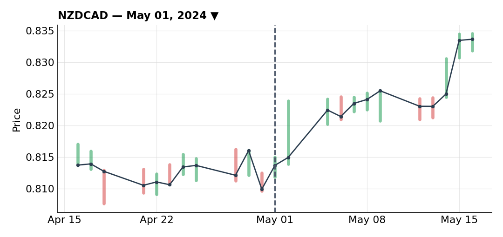
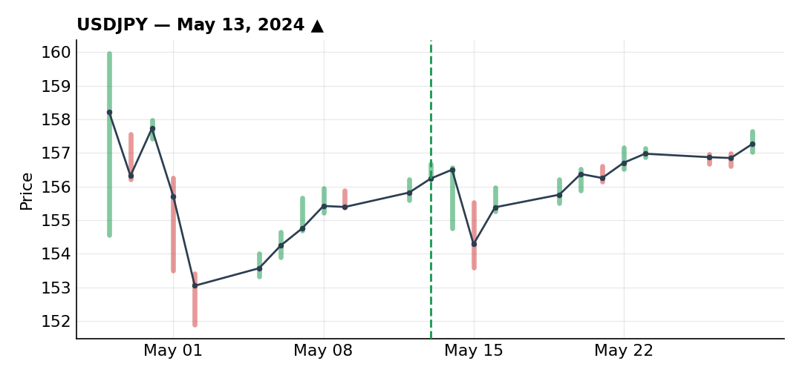
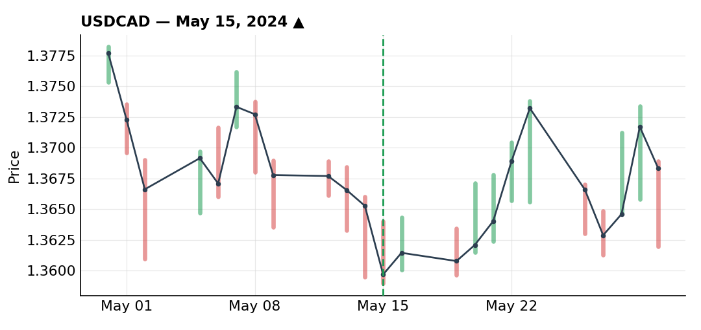

# May 2024

### A forgettable NZD/CAD short that turned into my biggest loss of May

***NZDCAD** · short · closed · May 01, 2024*

Early May had a risk-off tone to it, and NZD was in a clear downtrend, which made a short on NZD/CAD an easy idea to want to express. Technically it was clean: a proper pullback inside a well-respected channel, a break of that channel, then a correction back to the 50% Fibonacci for my entry, with a small prior high sitting right behind it as an obvious spot for the stop.

Retail was mostly buying into this move, which is exactly the kind of setup I like for trend-following — retail on the wrong side of an established trend. I got filled at the 50% level as planned.

There isn't much more to say about this one, and that's part of the lesson. Heavy volatility hit shortly after I got in — the position briefly went into profit before that same volatility took it out. Nothing wrong with the process here; the market just moved hard against a clean, well-reasoned setup. It ended up being my biggest loss of the month, but I don't have any real complaint about how I got into it or managed it — some trades just don't work, even when everything lines up on paper.

### USD/JPY long after the BOJ flush, and catching a PPI revision most people missed

***USDJPY** · long · closed · +0.63R · May 13, 2024*

This one starts on May 6, when a combination of dollar weakness and yen strength drove an aggressive ~5% drop in USD/JPY off the 160 area — a move triggered by intervention from the Japanese Ministry of Finance and the BOJ. My underlying view stayed the same through all of it: the uptrend on USD/JPY is still logical and pretty hard to argue with, driven by the US-Japan rate differential, and central bank interventions like this tend to only have a short-term impact unless you're dealing with an actual hard peg — the removal of the EUR/CHF peg back in 2015 being the exception that proves the rule. I expected this reaction to fade.

The problem was execution, not the idea. I wanted to buy the 61.8% Fibonacci level and a key support/resistance flip that had already been tested four times, but I couldn't get orders in fast enough for the May 6 dip. From there, price kept making new highs with pullbacks too shallow to trigger anything I had working — retail stayed mostly short the whole way up, which kept confirming my thesis, but being right with no position on is worth exactly nothing. Frustrating stretch.

I figured the BOJ was defending the 160 level, so I set my target just under it, on the view that a second intervention was less likely near-term given the cost — though the fact that the bounce stayed timid told me the first intervention had left a real mark on positioning. I finally got in on May 13: a classic trend-following long, wide stop, with price finding support right on the 50-day SMA on a small candle I used for the entry. I'll admit I didn't have the nerve to put a tight stop right behind that wick and used the prior low instead.

I only sized this at 50% of my usual risk, since I was already long dollars through GBP/USD and didn't want to stack too much USD exposure heading into PPI on Tuesday and CPI on Wednesday. PPI came in looking like a clear hawkish surprise on the surface — headline expected 0.3% (0-0.4% range), printed 0.5%; core expected 0.2%, also printed 0.5% — and the dollar popped on it. But March's PPI, originally reported at +0.2% both headline and core, got revised down to -0.1% this same release, a -0.3 point revision. Fold that into April's print and you get 0.5% minus 0.3 points, which is really about 0.2% — under expectations, not above them. That's a nuance most traders never catch. As soon as I worked through it, I cashed out 50% of the position; in hindsight I probably should have taken the whole thing off right there.

I held the remaining half hoping for a similar upside surprise on CPI the next day that would let me move my stop up, but got stopped out before I ever got the chance — the PPI bounce fully unwound and price kept drifting lower even ahead of the CPI release. Closed for +0.63R. Worth logging for two reasons: the psychological bias of watching a level play out exactly as expected with no position on, and the whole PPI-revision analysis, which is the kind of detail that actually moves the needle if you catch it in time.

### USD/CAD long off an overdone dollar drop on an in-line CPI

***USDCAD** · long · closed · +1.89R · May 15, 2024*

Three months running, US inflation had surprised to the upside — 3.1% in January, 3.2% in February, 3.5% in March — and that string kept the dollar supported. Going into the April print, the market was expecting a cooldown to 3.4%, which was already a well-telegraphed deceleration after that run of hot numbers.

The data came in exactly in line at 3.4%, and the market's reaction made no sense to me. An in-line print shouldn't move Fed rate-path expectations at all. I could understand some relief-rally dynamics after three consecutive upside surprises, but not a drop in the dollar that violent for a number that matched consensus.

Technically I had a longstanding uptrend trendline on USD/CAD with several touches (some more debatable than others) plus extra support from the 50-day SMA. DXY confirmed the same read — a break of its own downward trendline, a retest of Fibonacci levels that also happened to sit on its 50-day SMA, with a small rising trendline of its own. On the fundamental side, I kept coming back to a simple question: where does the money coming out of dollars actually go? Rotating into currencies whose central banks are even more dovish than the Fed, with lower rates, doesn't make much sense to me — which reinforced my view that the drop was overdone.

I managed the entry like catching a falling knife: deliberately wide stop, not tucked right under the wick or the 50-day SMA, because that kind of entry is risky even with strong fundamental conviction, so I gave price room to breathe. On the 4H, price drifted slightly lower after my entry before bouncing and breaking above the prior highs. Once that break happened and price pulled back again, I added to the position — by then I'd trailed my initial wide stop in tighter, so the reduced risk let me size up again, this time with a stop just behind the new lows since the reversal was confirmed. I was also watching a key resistance level and a descending counter-trendline above.

Management was in two steps. Near that resistance I took 25% off — not because I thought the trade was over (I'd have closed the whole thing if I did), but anticipating a continuation after the break, which is exactly what happened. A reversal eventually came through and hit my stop behind the prior low, closing out the remaining 75%. Total on the trade: +1.89R. I was glad to have it wrapped up right around when my vacation started — I'd rather fully close a position than try to babysit it while I'm away.

---

*+2.52R logged · 2W/0L*