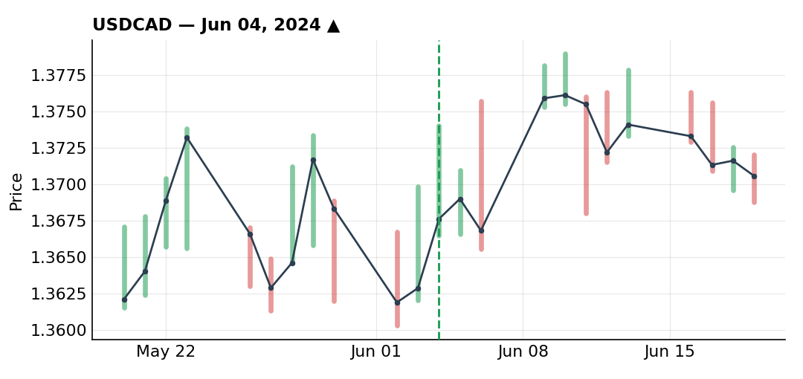
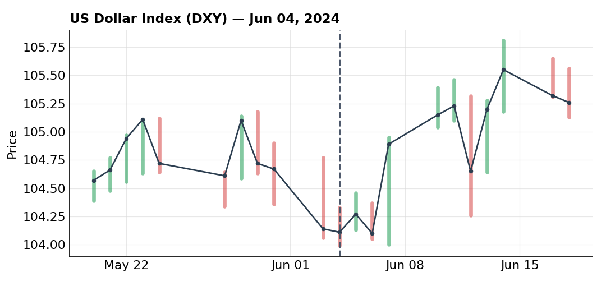
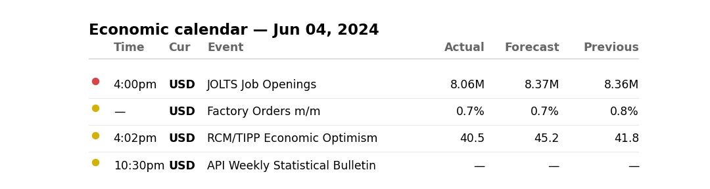
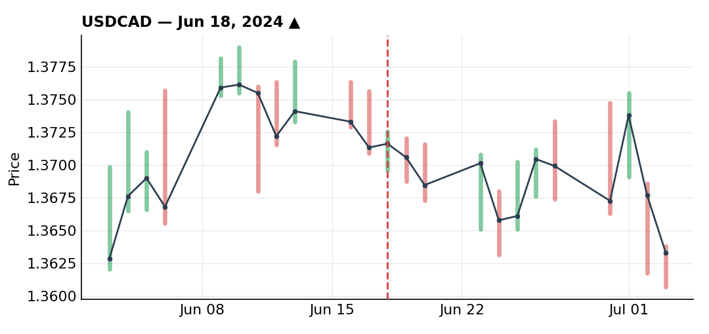
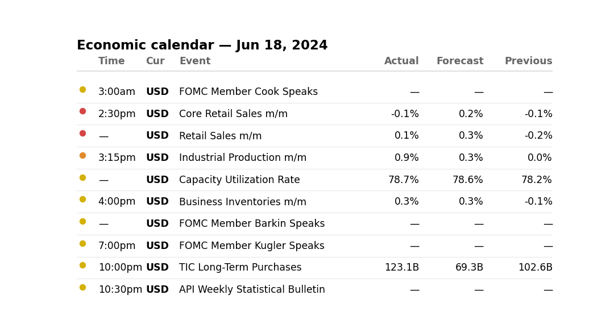
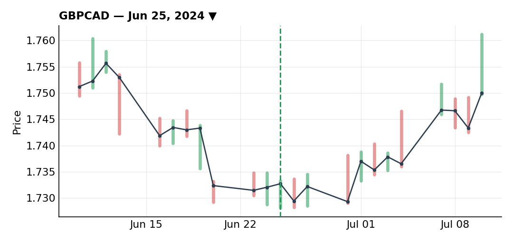
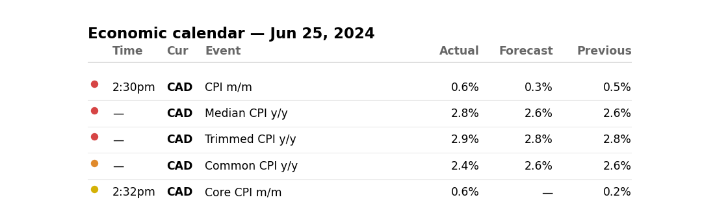

# June 2024

### Sixth USD/CAD long in six weeks, sized down for vacation

***USDCAD** · long · closed · +0.62R · Jun 04, 2024*

This was the sixth time I'd taken a long on USD/CAD over the past month and a half, riding the same dollar-buying idea I'd already been running the month before. On the daily, USD/CAD has been in a clean uptrend since the start of the year, currently in an impulse-then-pullback, with an old resistance level turned support reinforced by the 50-day SMA. DXY told the same story — uptrend since early 2024, trendline still holding.

Fundamentally I stayed with the classic rate-differential logic: interest rates reflect how the market perceives an economy's risk (high-rate emerging markets versus a euro I find less interesting right now, as an example), plus the residual disappointment around the dollar from May still working through the market. Retail was heavily short (more than 75%), which I read as bullish confirmation. I dropped to the 4H to study the bounce, saw a break of the highs, and executed on a Fibonacci retracement just under the 50%, with a wide stop under support rather than a tighter level I judged too close.

I sized this small on purpose — half risk because I already had a long EUR/CAD position on and didn't want to double up on CAD exposure, then another half-risk cut on top of that for being on vacation. That's 50% times 50%, so 25% of my normal size. The theoretical risk/reward on the setup was 2.8, but with that sizing the realized profit came out to roughly a quarter of what full size would have delivered.

I managed the calendar carefully around it: Monday (entry) I expected continuation; Tuesday I expected some profit-taking ahead of Wednesday's US CPI (expected 3.4%, came in at 3.3%); a small pullback ahead of the release seemed likely too. None of that was a prediction of the actual number — just a read of how other participants would probably behave. I trailed the stop aggressively from Monday onward and was fully out before the CPI print hit Wednesday. It ended up printing below expectations, technically dollar-positive on paper, but the market read it as dovish and the dollar dropped on the release — which confirmed exiting ahead of time was the right call.

Closed for +0.62R. Clean execution and management from start to finish — my only real regret is the tiny size I put on it. This is also the trade that set up the next one, since the idea I kept running here is exactly what got me into trouble a couple of weeks later.

**What the trade thesis pointed to:**

**Economic calendar that day:**

### Full-risk USD/CAD long stopped out — chasing a trendline that wasn't really there

***USDCAD** · long · closed · -1.00R · Jun 18, 2024*

Back from vacation, I decided I could go back to sending full risk and wanted to add another layer onto the same USD/CAD long idea. The thesis was, on paper, identical to the trade a couple weeks earlier — buying a dip in an uptrend I still believed in.

After I'd exited pre-CPI on the earlier trade, the dollar dropped on the release, then bounced — dip buyers came back in, which reinforced my conviction that dollar strength would keep going. I saw that drop as disproportionate for such a small miss (3.4% expected vs 3.3% actual), and figured it was really about four straight months of upside inflation surprises making this first downside miss feel bigger to the market than it should have — a reaction I didn't think was technically justified. I also leaned on a widening USD-CAD yield spread as a sign USD/CAD was undervalued and could keep climbing. Retail stayed mostly short, again read as bullish confirmation.

Technically, I had an uptrend trendline with several touch points, one sitting on the 50-day SMA — a rejection then a pump off a prior touch, followed by a small pullback back to that level. I used that dip to execute, with my stop placed further back, behind the retest and behind the 50% Fibonacci of the full impulse.

Instead of resuming the uptrend, price just sat in a two-day corrective slide and eventually stopped me out. I got in a bit early here, plain and simple. Looking back at that trendline with fresh eyes, it wasn't good quality — the first touch was legitimate, the second was already shaky, and the bounce I used for entry didn't even represent a clean new touch on the line. Either I shouldn't have taken this trade at all, or only with reduced risk — definitely not full risk, which is exactly what I did. A cleaner version of this trade would have been drawing a counter-trendline and waiting for momentum confirmation, off an upcoming macro print, before pulling the trigger.

The real cause here was stubbornness — a confirmation bias. This was the 6th or 7th long I'd taken on this pair over that stretch, most of them had worked out, and I had the idea so stuck in my head that I may have talked myself into seeing a technical structure that wasn't really there. Closed for -1R, the only full-risk loss I'm logging this month, and the clearest example this month of letting psychology override process rather than a clean, well-managed trade that just didn't work. For what it's worth, after this stop I got back into USD/CAD longs with more patience, waiting for my own levels instead of forcing it, and that next attempt worked out — but that's a separate position, not part of this one's numbers.

**Economic calendar that day:**

### GBP/CAD short — barely break-even, but the management was the point

***GBPCAD** · short · closed · +0.09R · Jun 25, 2024*

Nearly a scratch trade, but I'm logging it for the management rather than the result. I cut size to 60% of my usual risk for two reasons stacking together: a bullish divergence on the daily working against my bearish thesis, and end-of-period calendar risk — month-end, end of Q2, and end of H1, all at once, which raises the odds of aggressive portfolio-rebalancing flows that have nothing to do with the usual technical or fundamental drivers.

The divergence itself showed up on an oscillator (stochastic, most likely) — a shallower low than the previous one even as price kept printing new lows on the correction. That's a bullish divergence, and it's exactly why I didn't want full size on this. Technically I had a trendline break, a retest, a bearish impulse, then range-bound accumulation price action similar to something I'd seen before, ahead of an expected breakout in one direction or the other. A small counter-trendline formed with three touches, then an aggressive reaction on the fourth touch broke it, forming a small channel/flag.

Retail added one more layer of confluence: traders who'd been mostly short through GBP/CAD's prior uptrend (and wrong the whole way) flipped mostly long right at this point — another bearish contrarian signal on top of everything else. I entered with a stop above the trendline, above the 50-day SMA and above resistance — about as technical an execution as I get, with a defined risk/reward from the start. I want to be clear this wasn't a medium-term sterling-weakness thesis needing time to play out against the BoE — just a short-term technical, tactical impulse trade.

After entry, no real momentum showed up — price stayed under the 50-day SMA and the trendline without a clean break either way. I didn't cut immediately, but I started watching it closely and thinking about trailing stops precisely because the impulse scenario wasn't confirming. A failure to mark a new low, plus big daily wicks sitting right on the 0.7300 support with no daily close below it, told me the same thing. Eventually price broke my own bearish trendline — the exact invalidation signal for the setup I was actually trading — and I exited on the trailing stop rather than hang around for a different, longer-term thesis than the one I'd put on. Price then stayed range-bound rather than reversing lower, which tells me staying in would likely have led to a full stop-out — so getting out at the trendline break was the right call.

Closed for +0.09R, essentially flat. The real value in this one is the process: justified reduced size going in, clear invalidation criteria, and a clean, timely exit instead of stubbornly holding my original thesis. Worth noting this idea actually came from someone I trade ideas with, and I was fully on board with it — one more reason I took it in the first place.

**Economic calendar that day:**

---

*-0.29R logged · 2W/1L*