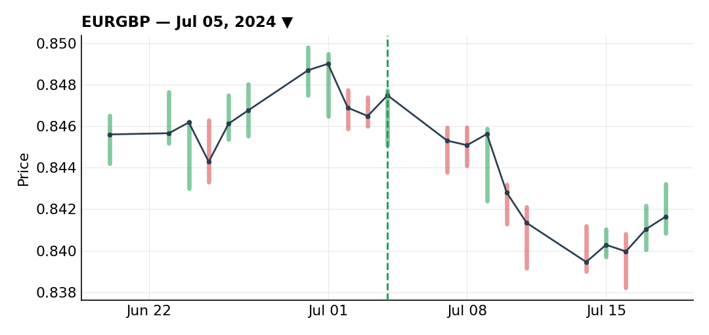
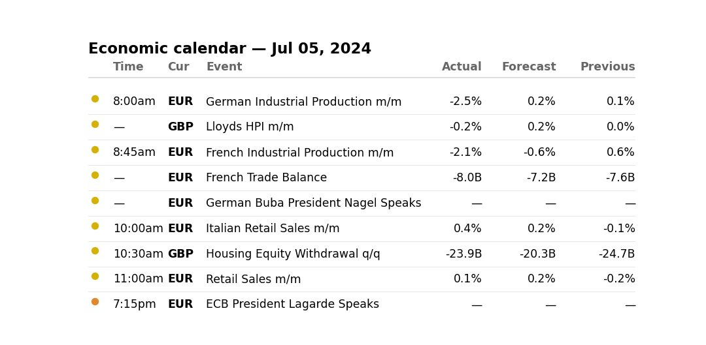
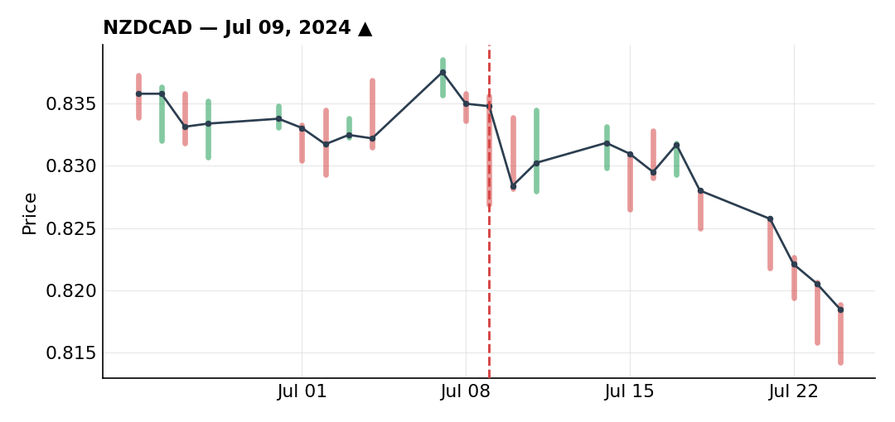
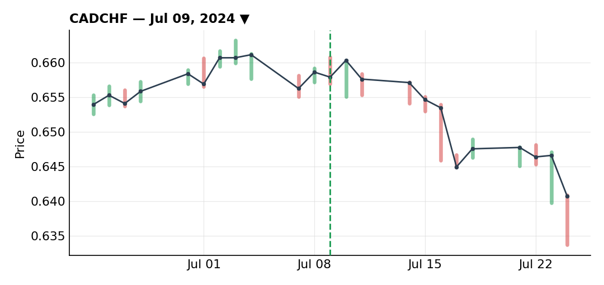

# July 2024

### EUR/GBP short scaled out perfectly through the UK election fade

***EURGBP** · short · closed · +3.95R · Jul 05, 2024*

Sterling had support behind it from the UK election outcome — fiscal policy read as reasonably positive, and just as important, the end of election-related uncertainty. Retail was heavily long (76%), which made me want to look for a fade on any pullback rather than chase strength.

On the daily, there was a major support zone around 0.85 that had held since June 2023, finally broke in early June 2024, and then got retested. What stood out to me was how impulsive that break looked — the entire drop took about five days on the daily, while the pullback back toward 0.85 took fifteen. That kind of asymmetry told me momentum was still much more bearish than bullish underneath the surface. I watched 0.85 closely without just dropping a blind limit order on it.

On the 4H I had a really clean counter-trendline, and the small bounce off it right before the break was, in hindsight, the best part of the whole trade — it let me place a tighter stop behind Fibonacci levels rather than under 0.85 outright, which would have given me a much worse risk/reward. Once I was in, EUR/GBP dropped as expected, continuing an already-bearish trend and reinforcing my conviction.

I managed the exit in stages rather than waiting for one target. First 50% came off at a small support around 0.8400 spot, just to take some risk off the table — that's roughly the point where a position like this starts feeling harder to manage cleanly. Then, on a Friday, seeing some indecision candles at that same support, I took another half of what remained (25% of the original size) off ahead of the weekend. Monday brought a gap up, a drop, then another bounce — forming a new low that was actually lower than the prior one while showing an RSI divergence, a possible sign momentum was turning. Between that signal and the same bounce pattern repeating, I cut another 25% on Wednesday, right ahead of the ECB rate decision.

With that divergence in place and price action I didn't love, I trailed my stop and figured I'd get taken out regardless — so I chose to exit voluntarily rather than wait for the stop, since holding onto just 25% of the position wasn't worth the attention it would take relative to putting that risk elsewhere. Total on the trade: +3.95R, probably my biggest single-position win of the year, and the final target was never even hit — a good reminder that managing the position well matters more than chasing a theoretical number. By the time I was looking back at this, price had already reversed back higher, which only confirmed that scaling out in pieces was the right call rather than holding for more.

**Economic calendar that day:**

### NZD/CAD long blindsided by a dovish RBNZ surprise

***NZDCAD** · long · closed · -1.00R · Jul 09, 2024*

Same underlying idea as the CAD/CHF trade I put on the same day: a bearish view on CAD for fundamental reasons. Here I expressed it by going long NZD/CAD instead of shorting CAD directly.

Technically there was a bullish impulse followed by a pullback retesting the 50-day SMA, the 0.83 level, and the 50% Fibonacci — a level I couldn't get filled on the first touch for lack of confirmation, but it was showing clear buying interest underneath. Retail was heavily short (80%), which added confidence to the long side.

I split the entry into two tranches on the 4H, waiting for the pullback to the 50% level to go long, which triggered. On the stop, I was weighing two options — a wider stop behind the lows, or a tighter, more aggressive one — and instead of picking one, I split the position: half with the wide stop, half with the tighter stop allowing more size. The idea was to get a better blended risk/reward than putting the whole thing behind one wide stop.

What killed the trade was an RBNZ meeting the next day that wasn't expected to bring much of a surprise. Instead, the RBNZ came out noticeably more dovish than expected, saying rates were already restrictive enough — that surprise dropped NZD fast and took out both the tight and the wide stop in short order, for a full -1R loss.

I don't consider this a bad trade at all. It's one I'd take again every single time given the same setup — there's a real difference between a good trade that ends in a loss and a bad trade that ends in a profit, and this is squarely the former. The event, not the thesis, is what beat me here.

### CAD/CHF short trailed candle-by-candle to +2.35R

***CADCHF** · short · closed · +2.35R · Jul 09, 2024*

Same bearish-CAD thesis as the NZD/CAD long I put on earlier the same day, but this time there was no adverse surprise waiting on the other side — no RBNZ-style shock — so the thesis actually got to play out in full.

The trigger was a textbook reversal candle on the weekly: a wick showing price rallied and then got rejected hard, closing the week back near Monday's open. A candle like that carries a lot more weight on a higher timeframe, and coming after an impulse-then-pullback sequence, it gave me a solid bearish read heading into the following week. On the daily, there was a resistance zone near a triple top; the pullback ran straight into that old support-turned-resistance and rejected cleanly, a rejection reinforced by weaker-than-expected Canadian data that both confirmed the thesis and helped trigger the reversal.

I dropped to the 4H/2H to wait for a pullback into that resistance and my Fibonacci levels. A first attempted drop didn't trigger my order, so I stayed patient until a sell-limit order actually filled, followed by a sharp drop and a bounce back toward the levels it had come from.

Heading into the weekend with roughly +1R floating, and knowing Canadian CPI was due the following Tuesday, I reasoned nobody would want to hold a big directional CAD bet into that kind of event risk — meaning I wouldn't open this position fresh at full size right then, so there was no reason to hold it at 100% either. I took 50% of the profit off at the bottom of the range ahead of the weekend. I'd prepared for a possible downside inflation surprise (a move back toward the BoC's 2% target) that would have let me add the size back, alerts and all, but the data printed with no real surprise, so there was no add-in — I just held the remaining 50% as-is. After a retest of the broken support that I chose not to add into, broader risk-off flows pushed CAD/CHF even lower, helped along by CHF's strength as the risk-off currency of the month.

The real management lesson here was the trailing. I didn't want to end up in a spot where price was 10 pips from target while my stop sat 80 pips away, even after moving it to breakeven — that kind of risk/reward stops making sense. I try to run a constant 'stop-squeeze,' tightening as I go to keep the running risk/reward positive. With momentum this strong, trailing behind classic swing highs felt too loose, so I dropped to the 1H and trailed behind every hourly candle close, mechanically, using phone alarms timed to each close so I wouldn't miss one. As the move kept going I dropped further still, to 15-minute candles, same close-by-close logic — and that's what eventually closed the position out at the levels it reached.

Looking back, price kept falling after I was out and would have eventually reached the original target, but staying exposed for that last bit of extra gain wasn't worth the risk. My rule of thumb here is simple: don't be greedy, take the profit — trying to scrape the very last pip rarely pays for the risk you're carrying while you wait for it. Closed for +2.35R — logged less for the technical execution, which was fairly similar to the NZD/CAD trade, and more for how a disciplined, mechanical trailing process turned a solid macro read into an actively managed win instead of a position I just let ride and hoped for the best.

---

*+5.30R logged · 2W/1L*